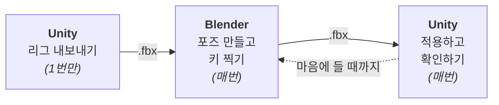
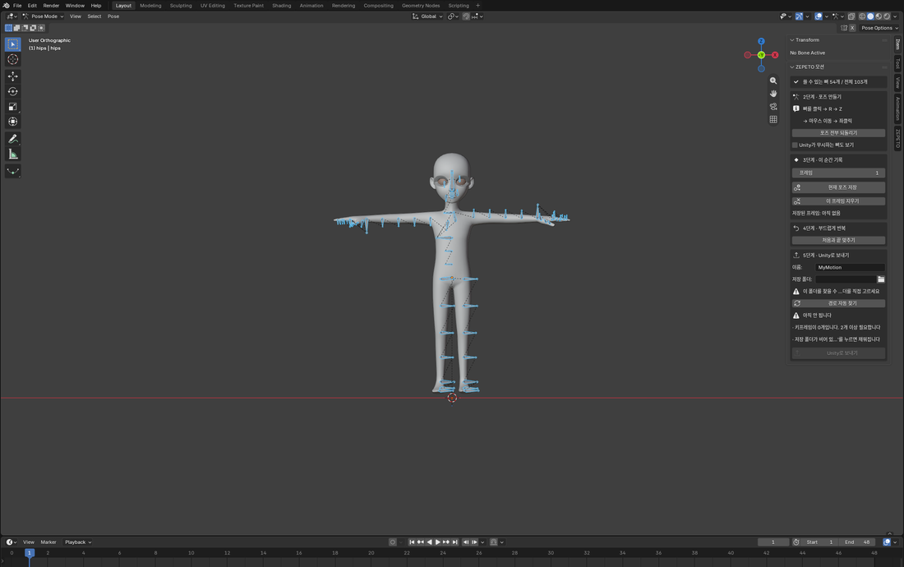
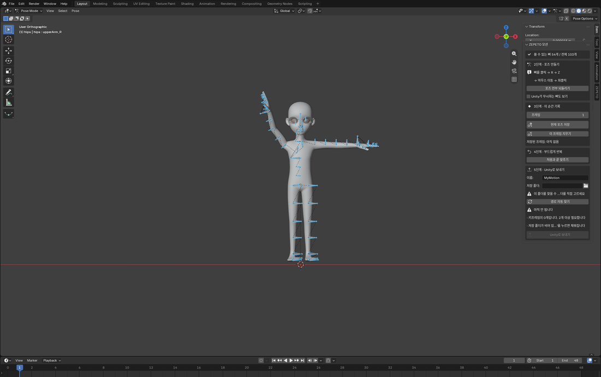
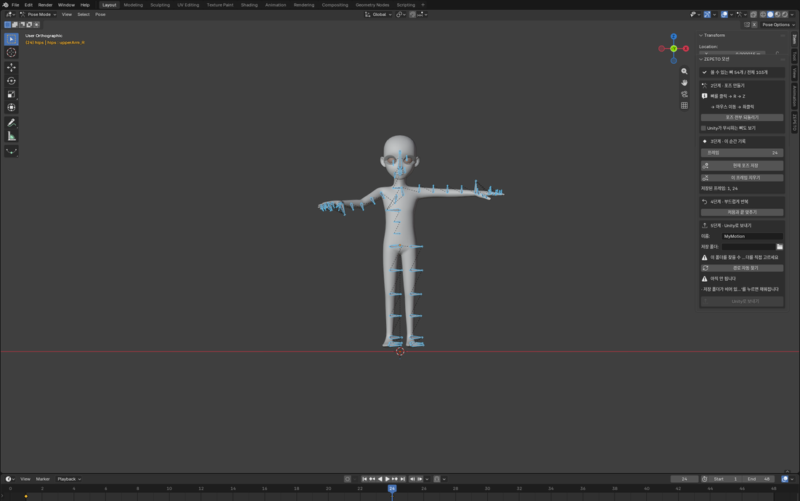
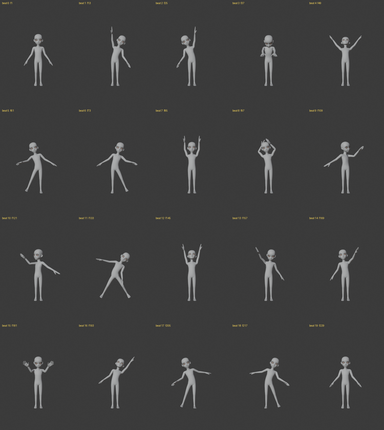
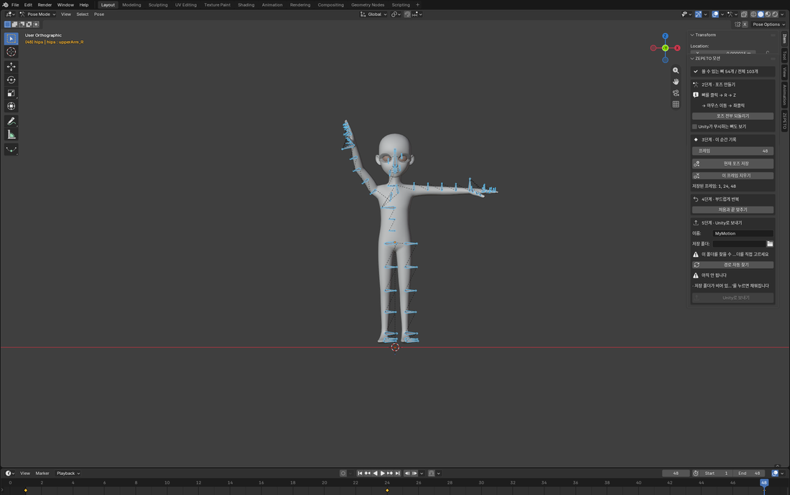
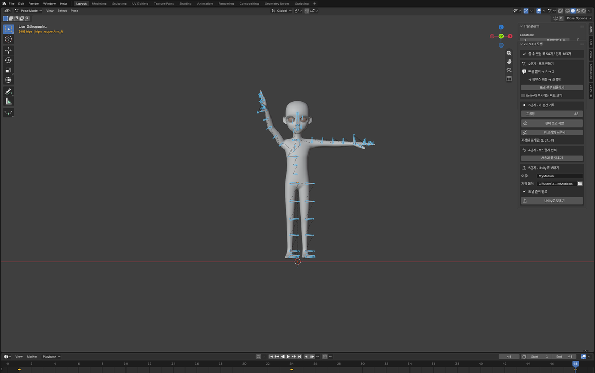

# ZEPETO 모션 만들기 — 초보자용 전체 가이드

Blender를 한 번도 안 써봤어도 됩니다. **버튼 다섯 개**만 순서대로 누르면 모션이 나옵니다.

> Unity 헬퍼 창은 1~7번으로 되어 있습니다. 이 문서가 다루는 Blender 왕복은 그중 **3 · 4 · 5번**입니다.

---

## ⚠️ 시작하기 전에 — 만든 모션은 제페토에 "아이템으로" 못 올립니다

**이걸 먼저 아셔야 합니다. 끝까지 만든 다음에 알면 늦습니다.**

제페토 스튜디오에 **모션 카테고리가 없습니다.** 업로드할 수 있는 것은 전부 착용 아이템(옷 · 헤어 ·
신발 · 가방 등)입니다. 앱 안의 포즈·제스처는 제페토 서버의 공식 라이브러리에서만 불러오기 때문에,
내가 만든 동작을 그 목록에 넣는 방법은 없습니다.

그래서 **7번 `제페토로 내보내기`가 만드는 `.zepeto` 파일에는 의상만 들어갑니다.** 모션은 안 들어갑니다.

| 하고 싶은 것 | 되나요 | 어떻게 |
| --- | --- | --- |
| 내가 만든 옷이 **움직일 때** 어떻게 보이는지 확인 | **됩니다** | 이 문서 전체가 그것입니다. 1~6번 |
| 그 **옷**을 제페토 스튜디오에 올리기 | **됩니다** | 7번 `.zepeto` → 스튜디오 웹 업로드 |
| 그 **모션**을 제페토 스튜디오에 올리기 | **안 됩니다** | 카테고리 자체가 없습니다 |
| 그 **모션**을 앱의 포즈/제스처 목록에 넣기 | **안 됩니다** | 서버 공식 라이브러리 전용입니다 |
| 그 **모션**을 다른 사람에게 보여주기 | **됩니다** | **ZEPETO World** — 유일한 공식 목적지입니다 |

**그래서 이 도구는 "옷이 움직이는 걸 미리 보는 도구"입니다.** 모션 자체를 팔거나 배포하고 싶다면
ZEPETO World 프로젝트를 따로 만들어야 하고, 그 방법은 Unity 헬퍼 **7번 카드 안의
`이 모션을 제페토에 넣기` 패널**이 4단계로 안내합니다 (문서 링크 버튼도 그 안에 있습니다).

> 근거: 공식 문서 · 스튜디오 제품 목록 · 크리에이터 프로그램 · World SDK 제스처 API ·
> `naverz/zepeto-studio-global` GitHub Discussions의 제페토 직원 답변 #44 / #67.
> 확인하지 못한 것은 비공개 파트너용 모션 파이프라인의 존재 여부뿐이고, 공개 문서에는 없습니다.

---

## 전체 그림



**Unity 리그 내보내기는 이미 끝나 있습니다.** 처음 한 번만 하면 되는 작업이고,
`Assets/ZepetoHelper/Rig/ZepetoBaseModel.fbx` 에 저장돼 있습니다. 다시 할 일은 없습니다.

그러니까 실제로 매번 하는 건 **Blender 5단계 → Unity 5번(라이브 확인)**, 이게 전부입니다.

---

## 준비 확인

| 항목 | 상태 | 위치 |
| --- | --- | --- |
| Blender | 5.2.0 LTS 설치됨 | `C:\Program Files\Blender Foundation\Blender 5.2` |
| ZEPETO 리그 | 내보내기 완료 (뼈 103개) | `.../Assets/ZepetoHelper/Rig/ZepetoBaseModel.fbx` |
| 작업 파일 | 몸까지 불러온 상태로 저장됨 | `BlenderMotion\zepeto_motion.blend` |
| 프레임레이트 | 24 fps, 1~48프레임 (2초) | 애드온이 자동 설정 |
| ZEPETO 애드온 | **설치 완료 · 켜짐** | `%APPDATA%\Blender Foundation\Blender\5.2\scripts\addons\zepeto_motion_helper.py` |
| 저장 폴더 | **처음엔 비어 있음** — `경로 자동 찾기` 한 번 (아래 5단계) | 패널 5단계의 `저장 폴더` 칸 |
| 제페토 아이디 | 라이브 확인 전에 **Unity 1번**에 한 번 입력 | 헬퍼 1번 카드의 `아이디` 칸 |

> 위 표가 맞는지는 매번 확인할 수 있습니다. 이 문서에 적힌 순서를 그대로 눌러 보는 검사가 있습니다:
> ```
> "C:\Program Files\Blender Foundation\Blender 5.2\blender.exe" --background BlenderMotion\zepeto_motion.blend --python BlenderMotion\beginner_check.py
> ```
> `pass=15 fail=0` 이 나오면 이 문서대로 따라했을 때 FBX가 실제로 만들어진다는 뜻입니다.

### 애드온 — 이미 설치돼 있습니다

Blender를 열고 3D 화면에서 **N** 키를 누르면 사이드바에 **`ZEPETO 모션`** 패널이 있습니다.
`Item` 탭에도 `ZEPETO` 탭에도 같은 패널이 나옵니다. 할 일은 없습니다.

> **이 문단은 예전에 "설치본은 없습니다"였습니다.** 실제로 그랬습니다 —
> `%APPDATA%\Blender Foundation\Blender\5.2\scripts\addons\`도 `config\`도 비어 있었고, Blender를 열어도
> `ZEPETO` 탭이 없었습니다. 그런데 헤드리스 검사 28개는 계속 전부 통과하고 있었습니다. 그 검사들은
> `sys.path`에 폴더를 끼워 넣고 모듈을 직접 import하기 때문입니다 —
> **검사가 통과한다는 것과 이 컴퓨터에서 쓸 수 있다는 것은 다른 문장이었습니다.**

#### 다시 설치해야 할 때

애드온 파일(`BlenderMotion\zepeto_motion_helper.py`)을 **고친 뒤**, 그리고 Blender를 새로 깔거나
다른 컴퓨터로 옮겼을 때입니다. Blender의 설치는 링크가 아니라 **복사**라서, 원본을 고쳐도 Blender는
예전 사본을 계속 돌립니다. 에러가 나지 않으므로 "고쳤는데 그대로예요"로만 나타납니다.

```
"C:\Program Files\Blender Foundation\Blender 5.2\blender.exe" --background --python BlenderMotion\install_addon.py
```

`PASS :: 설치 완료` 두 줄이 나오면 끝입니다. Blender가 열려 있었다면 껐다 켜세요.

> 낡은 사본이 도는 상태는 `headless_check.py`의 `install:copy-matches-source`가 잡습니다. 두 파일을
> 내용으로 비교해서 다르면 실패로 만듭니다.

#### 손으로 하려면

1. **Edit > Preferences > Add-ons**
2. 오른쪽 위 **▼** 를 눌러 **Install from Disk...** (예전 Blender에서는 그냥 **Install** 버튼입니다)
3. `BlenderMotion\zepeto_motion_helper.py` 를 고릅니다
4. 목록에 뜬 **`ZEPETO 모션 헬퍼`** 의 체크박스를 켭니다

설치하지 않고 이번 한 번만 써 보려면 **Scripting** 워크스페이스에서 그 파일을 **Open** 하고
**Run Script**(`Alt+P`)를 눌러도 됩니다. Blender를 끄면 사라집니다.

---

# Blender에서 (5단계)

`zepeto_motion.blend` 를 더블클릭해서 엽니다.
오른쪽 사이드바에 **`ZEPETO 모션`** 이라는 패널이 보이면 준비 끝입니다.

> 사이드바가 안 보이면 3D 화면에 마우스를 올리고 **N** 키를 누르세요.
> 그래도 없으면 애드온이 안 켜진 것입니다 — 위 **애드온 — 이미 설치돼 있습니다**의
> `다시 설치해야 할 때` 로 돌아가세요.

## 1단계 — ZEPETO 몸



*오른쪽 사이드바의 `ZEPETO 모션` 패널이 5단계를 위에서 아래로 늘어놓습니다. 맨 위 줄이
`쓸 수 있는 뼈 54개 / 전체 103개`입니다.*

패널 맨 위에 **`쓸 수 있는 뼈 54개 / 전체 103개`** 라고 떠 있으면 몸이 이미 들어와 있는 것이니 넘어가세요.
대신 **`1단계 · 몸 불러오기`** 칸이 보인다면 **`ZEPETO 몸 불러오기`** 를 누르면 됩니다.
카메라가 알아서 정면에 캐릭터를 맞춰줍니다.

> **54와 103이 왜 다른가:** 리그의 뼈는 103개지만 Unity가 인식하는 건 54개뿐이라 나머지 49개는 애드온이
> 숨겨 놨습니다. 이유는 아래 **안 보이는 뼈가 있는 이유** 에 자세히 적어 뒀습니다.

> 몸을 한 번 불러오면 `1단계 · 몸 불러오기` 칸은 사라집니다. 엉뚱한 뼈대(다른 데서 가져온 리그 등)가
> 들어왔다면 맨 위에 **`이 리그는 ZEPETO 기본 몸과 뼈 이름이 다릅니다`** 경고가 뜨고, 그 밑에
> **`다시 불러오기`** 버튼이 같이 나타납니다.

## 2단계 — 포즈 만들기



*파란 막대가 뼈입니다. 여기서는 오른팔(`upperArm_R`)을 위로 돌렸습니다. 몸통 메시는 클릭해도
안 잡히므로 마우스는 항상 뼈에 떨어집니다.*

이게 유일하게 "손으로 하는" 작업입니다.

1. 화면에서 **파란 뼈**를 클릭 (몸통은 클릭해도 안 잡히게 막아뒀습니다)
2. **R** 키 → 마우스 움직이면 회전 → **좌클릭**으로 확정
3. 취소는 **우클릭** 또는 **Esc**, 되돌리기는 **Ctrl+Z**
4. 한 축으로만 돌리려면 `R` 다음에 `X` / `Y` / `Z`

망쳤으면 **`포즈 전부 되돌리기`** 버튼 한 번이면 원래대로 돌아옵니다.

> ⚠️ **회전(R)만 쓰세요.**
> 이동(**G**)과 크기(**S**)는 Unity Humanoid가 통째로 무시합니다.
> Blender에서 잘 보이던 동작이 Unity에서 안 나오는 원인 1위가 이겁니다.

### 안 보이는 뼈가 있는 이유

리그에는 뼈가 103개인데 화면에는 **54개만** 보입니다. 나머지 49개는 애드온이 숨겼습니다.

Unity의 Humanoid는 뼈 55개만 인식합니다. 거기 없는 뼈는 **아무리 돌려도 Unity에서 그냥 사라집니다** —
에러도 경고도 없이, 그 관절만 안 움직입니다. 원인을 찾기가 거의 불가능한 종류의 실패라
아예 클릭이 안 되게 막아뒀습니다.

숨긴 뼈들:

| 종류 | 예 | 왜 무시되나 |
| --- | --- | --- |
| `*Twist*` | `upperArmTwist_L`, `lowerRegTwist_R` | Humanoid에 매핑이 없습니다. 팔을 비틀고 싶으면 `lowerArm_*`을 돌리세요 |
| `*_scale` | `chest_scale`, `pelvis_scale` | 체형 변형 전용. 모션이 아닙니다 |
| `pelvis` | | 매핑된 건 `pelvis`가 아니라 리그 루트입니다 (아래 참고) |
| 얼굴 | `jaw`, `nose`, `lip_L`, `hairAll` | `eye_L`/`eye_R`/`mouth`만 매핑돼 있습니다 |
| `heel_L/R` | | 매핑 없음 |

정말 보고 싶으면 위 **2단계 · 포즈 만들기**의 **`Unity가 무시하는 뼈도 보기`** 체크박스를 켜면 됩니다.
켜더라도 `현재 포즈 저장`은 매핑된 뼈에만 키를 찍으므로, 숨겨진 뼈를 돌려도 클립에는 들어가지 않습니다.

> **골반(Hips)은 Blender에서 못 돌립니다.**
> ZEPETO FBX에서 `hips`는 뼈가 아니라 **리그(오브젝트) 자체**입니다. Blender가 최상위 뼈를
> 아마추어 오브젝트로 바꾸기 때문입니다. 그래서 골반 회전은 여기서 만들 수 없고,
> 오브젝트를 움직이면 아바타가 통째로 화면 밖으로 나갑니다. 몸통을 기울이려면 `spine`을 쓰세요.

## 3단계 — 이 순간 기록



*`저장된 프레임: 1, 24` 줄이 3단계 칸 안에 나타납니다. 아래 타임라인에도 키가 마름모로 찍힙니다.*

포즈를 만들었으면 "몇 번째 프레임의 포즈인지" 저장해야 합니다.

1. **`프레임`** 칸에 숫자를 넣습니다 (1 → 24 → 48 순서를 추천)
2. **`현재 포즈 저장`** 클릭
3. 다음 프레임으로 옮기고, 포즈를 바꾸고, 다시 저장 — 반복

`저장된 프레임: 1, 24, 48` 처럼 목록이 늘어나면 잘 되고 있는 겁니다.
잘못 찍었으면 그 프레임에서 **`이 프레임 지우기`**.

> **최소 2개** 이상 필요합니다. 1개면 그냥 정지 포즈라서 Unity가 동작으로 안 봅니다.
> 개수만 채워도 안 됩니다 — 두 프레임의 포즈가 똑같으면 결국 정지 화면이라, 애드온이
> `키프레임은 있지만 포즈가 전부 같습니다` 라고 막습니다. 프레임을 옮긴 다음 **뼈를 돌리고** 저장하세요.

**스페이스바**를 누르면 지금까지 만든 걸 미리 재생해볼 수 있습니다.

### 노래에 맞춰 춤을 짜려면 — 프레임과 박자 맞추기

3단계를 반복하면 그대로 안무가 됩니다. 핵심은 **한 비트가 몇 프레임인지** 계산하는 것뿐입니다.

```
비트당 프레임 = 24 ÷ (BPM ÷ 60)
```

| 곡 템포 | 비트당 프레임 | 10초에 들어가는 비트 |
| --- | --- | --- |
| 100 BPM | 14.4 (14 또는 15로 반올림) | 약 16비트 |
| **120 BPM** (K-pop에서 가장 흔함) | **12** | **20비트** |
| 128 BPM | 11.25 | 약 21비트 |
| 140 BPM | 10.3 | 약 23비트 |

120 BPM이면 **1, 13, 25, 37 …** 프레임에서 `현재 포즈 저장`을 누르면 정확히 박자에 떨어집니다.
10초를 만들려면 타임라인 끝(`frame_end`)을 **240**으로 늘리세요 — Blender 화면 아래쪽
`End` 칸입니다. 기본값 48은 2초입니다.

> **곡을 Blender에 넣어 들으면서 맞출 수도 있습니다.** Video Sequencer에 오디오를 추가하면
> 스페이스바 재생 때 소리가 같이 납니다. 애드온이 관여하지 않는 Blender 기본 기능이고,
> 내보낼 때 FBX에는 소리가 들어가지 않습니다(모션만 나갑니다).

#### 실제로 만들어 본 예 — 10초 20비트



이 20장이 `1, 13, 25 … 229` 프레임에서 `현재 포즈 저장`을 누른 결과이고, 마지막에
`처음과 끝 맞추기`로 240프레임을 1프레임과 같게 만들어 루프를 닫았습니다.
같은 안무를 그대로 다시 만드는 스크립트가 있습니다:

```
"C:\Program Files\Blender Foundation\Blender 5.2\blender.exe" --background BlenderMotion\zepeto_motion.blend --python BlenderMotion\make_dance.py
```

`make_dance.py` 맨 위에 **뼈마다 어느 축이 어떤 동작인지**를 표로 적어 뒀습니다. 실제로 돌려 보고
렌더해서 확인한 값이라, 직접 안무를 짤 때 그대로 참고하시면 됩니다.

> 특정 곡의 실제 안무는 저작물입니다. 위 동작은 창작이고, 남의 안무를 그대로 옮겨 배포하는 것은
> 피하세요.

### 얼굴도 움직일 수 있습니다 — 눈과 턱만

**됩니다.** 얼굴 뼈만 움직이는 클립을 만들어 Unity에 넣어 봤더니, Humanoid 클립 안에
`Jaw Close`(변화폭 2.60) · `Left/Right Eye Down-Up`(각 1.64) · `Left/Right Eye In-Out`(각 0.34)
커브가 값이 변하는 채로 들어왔습니다. 그 클립의 커브 130개 중 변화폭 상위 5개가 전부 얼굴이었습니다.

쓸 수 있는 뼈는 **셋뿐**입니다.

| 화면에서 고를 뼈 | Unity에서 되는 것 | 어떻게 |
| --- | --- | --- |
| `eye_L` · `eye_R` | **눈동자 방향** | `R` → `X`로 위아래, `Z`로 좌우 |
| **`mouth`** | 턱 | `R` → `X`로 입 벌리기 |

> ⚠️ **턱은 `jaw`가 아니라 `mouth`입니다.** `jaw`라는 뼈도 있지만 Unity 매핑이 없어서 숨겨져 있고,
> 돌려도 조용히 사라집니다. `nose` · `lip_L` · `lip_R`도 마찬가지입니다.

> ⚠️ **눈은 깜빡이지 않습니다.** 눈꺼풀 뼈가 아예 없습니다 — 얼굴 쪽 뼈는 `eye_L` · `eye_R` ·
> `mouth` 셋뿐이고 `lid` · `blink` 같은 이름은 하나도 없습니다. `eye_L`을 돌리면 움직이는 것은
> **눈알 385개 정점**뿐이라, 눈동자가 어디를 보는지만 바뀝니다.
> (이 문서는 한동안 "감았다 뜨기"라고 적어 두었습니다. 틀린 설명이었고 고쳤습니다.)

**웃는 표정도 못 만듭니다.** 표정은 보통 블렌드셰이프(모프)로 만드는데 이 몸에는 그게 **0개**이고,
Humanoid 클립은 애초에 블렌드셰이프를 담지 못합니다. 되는 것은 **눈동자 방향**과 **입 벌리기**
두 가지뿐입니다. 깜빡임 · 미소 · 눈썹은 전부 안 됩니다.

얼굴 뼈는 아주 작아서 화면을 확대(마우스 휠)해야 잡기 편합니다. 움직임도 1~2cm 수준이라
멀리서 보면 티가 잘 안 납니다 — 카메라가 얼굴에 가까울 때 효과가 있습니다.

## 4단계 — 부드럽게 반복



*`처음과 끝 맞추기`를 누르면 마지막 프레임(48)에 1프레임과 같은 포즈가 복사되어
`저장된 프레임`이 `1, 24, 48`이 됩니다.*

**`처음과 끝 맞추기`** 버튼 한 번.

1프레임 포즈를 48프레임에 복사해서, 반복 재생할 때 툭 끊기는 걸 없애줍니다.
ZEPETO 안에서는 동작이 계속 반복되므로 사실상 필수입니다.

## 5단계 — Unity로 보내기



*조건이 다 맞으면 `아직 안 됩니다` 목록이 사라지고 **`보낼 준비 완료`** 로 바뀌면서
`Unity로 보내기` 버튼이 살아납니다. 위 캡처가 그 상태입니다.*

1. **`이름`** 칸에 영어로 이름을 씁니다 (예: `Wave`, `Jump`)
   - `\ / : * ? " < > |` 는 쓸 수 없고, 마침표나 공백으로 끝나도 안 됩니다. 어기면 이유가 뜹니다.
   - `CON` `PRN` `AUX` `NUL` `COM1`~`COM9` `LPT1`~`LPT9` 도 안 됩니다. Windows가 장치 이름으로 예약해 둔
     단어라 파일로 만들 수 없습니다.
   - **같은 이름에 덮어쓰세요.** 새 이름으로 보내면 Humanoid 설정이 없어 한 번은 Play를 멈춰야 합니다.
2. **`저장 폴더`** 칸이 채워져 있는지 봅니다 (아래 참고)
3. **`Unity로 보내기`** 클릭

> **Play를 켜둔 채로 보내면 바로 반영됩니다.**
> Unity 헬퍼 **5번**의 초록 **`내 캐릭터로 확인 시작 (Play)`** 를 먼저 누르면, 내 실제 아바타(얼굴·머리·옷 전부)가
> 서버에서 내려옵니다. 그 상태에서 Blender로 돌아와 포즈를 고치고 `Unity로 보내기`만 누르면
> **Play를 끄지 않고** 동작이 바뀝니다. 다만 보낸 뒤 **Unity 창을 한 번 클릭**해야 합니다 —
> Unity가 뒤에 있는 동안에는 Play가 멈춰 있어 파일 감시도 쉬어가기 때문입니다.
> 누를 버튼은 없습니다. 창을 앞으로 가져오는 것까지가 전부입니다.
>
> 고칠 때마다 **Blender 버튼 하나 + Unity 창 클릭**. 이게 가장 빠른 작업 방식입니다.

### 저장 폴더 — 보통은 신경 쓸 일이 없습니다

저장 위치는 애드온이 알아서 찾습니다. 찾는 곳은 여기입니다:
```
ZEPETO Studio Unity Project File 3.2.16\Assets\CustomMotions\
```

**`저장 폴더`** 칸은 그 결과를 그냥 보여 주는 칸입니다. 채워져 있으면 그대로 두세요.

> **처음 열면 이 칸은 비어 있습니다. 고장이 아닙니다.**
> `.blend`에는 일부러 아무 경로도 저장해 두지 않았습니다 — 절대 경로를 넣어 두면 그 경로는 그 컴퓨터
> 에서만 맞고, 다른 사람이 파일을 열었을 때 없는 폴더를 가리키게 됩니다(실제로 예전에 그랬습니다).
> 그래서 **`경로 자동 찾기`를 한 번 누르는 것이 정상 순서**이고, 한 번 누르면 그 씬에는 계속 남습니다.

비어 있거나 빨간 경고가 뜬다면, 바로 밑에 나타나는 **`경로 자동 찾기`** 버튼을 한 번 누르면 됩니다.
대개 이걸로 끝납니다.

이런 경우에도 그렇게 됩니다:

- `.blend` 파일을 **다른 컴퓨터에서 가져왔을 때** — 안에 저장돼 있던 경로가 이 컴퓨터에는 없습니다
- Unity 프로젝트 폴더를 **옮기거나 이름을 바꿨을 때**
- 프로젝트를 **압축 해제한 직후** — `Assets\CustomMotions` 폴더가 아직 없을 수 있습니다.
  Unity를 한 번 열었다 닫으면 생깁니다

**`경로 자동 찾기`를 눌렀는데도 안 되면**, 버튼이 그 이유를 한국어로 알려 줍니다. 가장 흔한 건
`Unity 프로젝트로 보이는 폴더가 2개라서 고르지 못했습니다` 입니다. 예전에 받아 둔
`... 3.2.12` 같은 폴더가 옆에 남아 있으면 어느 쪽인지 애드온이 알 수 없어서, **찍지 않고 물어봅니다.**
(엉뚱한 프로젝트로 보내면 "성공했다는데 Unity에 아무것도 안 나타나는" 상태가 됩니다.)

해결 방법은 둘 중 하나입니다.

- **간단한 쪽:** `저장 폴더` 칸의 폴더 아이콘을 눌러 쓰려는 프로젝트의 `Assets\CustomMotions` 를 직접 고릅니다
- **한 번만 정해 두는 쪽:** Windows 환경 변수 **`ZEPETO_UNITY_PROJECT`** 에 쓰려는 프로젝트 폴더 경로를
  넣어 둡니다. 그러면 애드온이 항상 그 프로젝트를 씁니다

  > 설정하는 법: 시작 메뉴에서 `환경 변수` 검색 → **시스템 환경 변수 편집** → **환경 변수(N)...** →
  > 위쪽 `사용자 변수`에서 **새로 만들기(N)...** → 변수 이름 `ZEPETO_UNITY_PROJECT`,
  > 변수 값에는 `Assets` 폴더가 들어 있는 **프로젝트 폴더**(예:
  > `C:\Users\...\Desktop\zepeto\ZEPETO Studio Unity Project File 3.2.16`) 를 넣습니다.
  > **Blender를 껐다 켜야** 적용됩니다.

### 버튼이 회색일 때

못 누르는 게 아니라 **아직 조건이 안 맞은 겁니다.**
버튼 바로 위에 `아직 안 됩니다` 아래로 이유가 한국어로 하나씩 적혀 있습니다. 그것만 해결하면 살아납니다.

| 뜨는 말 | 뜻 |
| --- | --- |
| `키프레임이 0개입니다. 2개 이상 필요합니다` | 3단계에서 `현재 포즈 저장`을 아직 안 눌렀습니다 |
| `키프레임은 있지만 포즈가 전부 같습니다` | 프레임만 옮기고 뼈를 안 돌렸습니다 |
| `fps가 30입니다. 24로 바꾸세요` | 씬 프레임레이트가 24가 아닙니다. 1단계 버튼을 다시 누르면 24로 맞춰집니다 |
| `이동/크기가 바뀐 뼈: ...` | 뼈를 `G`로 옮기거나 `S`로 키웠습니다. `포즈 전부 되돌리기` |
| `리그 오브젝트가 움직였습니다` | 뼈가 아니라 리그 전체를 끌었습니다. `포즈 전부 되돌리기` |
| `Unity가 무시하는 뼈에 키가 있습니다: ...` | 숨겨진 뼈를 꺼내서 키를 찍었습니다. 그 키를 지우세요 |
| `이름 칸이 비어 있습니다` / `이름에 쓸 수 없는 문자가...` | 위 1번 규칙을 보세요 |
| `저장 폴더가 비어 있습니다` / `저장 폴더가 없습니다: ...` | 바로 아래 **`경로 자동 찾기`** 를 한 번 누르세요. 그래도 안 되면 바로 위 **저장 폴더** 항목 |

내보내기 옵션(Leaf Bones 끄기, Bake Animation, -Z Forward / Y Up 등)은
**버튼이 알아서 맞춥니다.** File > Export 메뉴를 직접 쓸 필요 없습니다.

---

# Unity에서

Unity를 열고 **`Window > Easy > ZEPETO Studio Helper`** 로 헬퍼 창을 띄웁니다.

## 먼저 한 번만: 1번에 내 제페토 아이디

**5번의 라이브 확인은 내 아이디로 내 아바타를 서버에서 내려받습니다.** 그래서 아이디가 없거나 틀리면
Play를 눌러도 아바타가 나타나지 않습니다. 5번으로 가기 전에 1번 카드를 한 번 채워 두세요.

1. **1번** 카드의 **`아이디`** 칸에 본인 제페토 아이디를 씁니다 (앞에 `@`를 붙여도 알아서 뗍니다)
2. **`ID 적용`** 을 누릅니다

아이디는 씬의 `LOADER` 오브젝트에만 저장됩니다. 한 번 넣으면 창을 다시 열어도 그대로 있습니다.

> 여기서 말하는 아이디는 제페토 앱의 **프로필에 표시되는 아이디**(`@` 뒤에 오는 문자열)이지
> 닉네임이 아닙니다. 이메일이나 URL을 넣으면 헬퍼가 거절합니다.
>
> 잘못 눌러서 망가지지는 않습니다. 헬퍼는 잘못된 아이디를 받으면 **씬에 있던 값을 덮어쓰지 않고
> 거절만 합니다** (자체 테스트의 `apply-id:reject-invalid`가 그것을 확인합니다).

## 가장 빠른 방법: 라이브 확인

헬퍼 **5번**의 초록 **`내 캐릭터로 확인 시작 (Play)`** 버튼 하나만 누르면 됩니다.

1. Play가 켜지고 **내 실제 ZEPETO 아바타**가 내려옵니다 (얼굴·머리·옷 전부)
2. Blender로 전환 → 포즈 고치기 → **`Unity로 보내기`**
3. **Unity 창을 다시 클릭**하면 1~2초 안에 동작이 바뀝니다. Play는 계속 켜둡니다
4. 2~3번을 마음에 들 때까지 반복

패널의 **`적용된 횟수`** 가 올라가면 적용된 것입니다. 안 올라가면 바로 위에 이유가 한국어로 뜹니다.

> 이 버튼은 Unity 설정 하나를 자동으로 바꿉니다 (`Script Changes While Playing` → `Recompile After
> Finished Playing`). Play 중에 스크립트가 컴파일되면 ZEPETO SDK 내부 상태가 끊어져서 아바타가
> 얼어붙기 때문입니다.

## 아래는 예전 방식 (라이브 확인이 안 될 때)

### 수동 등록 (Blender를 안 거친 파일만)

1. Unity 창으로 전환하면 자동으로 임포트됩니다 (잠깐 기다리세요)
2. 헬퍼 **5번** 안의 **`직접 등록하기 (Mixamo 등)`** 를 펼칩니다
3. Project 창에서 방금 만든 **FBX를 클릭**해서 선택합니다
4. **`1. FBX를 ZEPETO용으로 설정`** ← Animation Type을 Humanoid로 바꿉니다
5. **`2. 내 모션으로 추가`** ← `.anim`으로 뽑아서 목록에 넣습니다

4번과 5번은 **반드시 이 순서**입니다. 5번을 먼저 누르면 목록에 `(Humanoid 아님)`이라고 뜹니다.

### 확인

1. 동작 목록에서 **`[내 모션]`** 표시된 항목을 고릅니다
2. **`미리보기 Play`**
3. 동작이 마음에 안 들면 **6번 클립 조정** 에서 속도·구간을 다듬습니다

---

# 다 만들었으면 — 여기가 끝입니다

**모션은 여기서 끝납니다.** 맨 위 경고를 다시 읽어 주세요: 만든 모션은 제페토 스튜디오에
아이템으로 올릴 수 없습니다.

지금부터 갈 수 있는 길은 두 갈래입니다.

**① 옷을 올린다 (스튜디오)**

**7번 `제페토로 내보내기`** 가 `.zepeto` 파일을 만듭니다. 그 파일을 제페토 스튜디오 웹에 올리면
됩니다. 지금까지 만든 모션은 **그 파일에 들어가지 않습니다** — 모션은 그 옷이 움직일 때 어떻게
보이는지 확인하는 데 쓴 것이고, 확인은 이미 끝났습니다.

**② 모션을 보여준다 (월드)**

7번 카드 안의 **`이 모션을 제페토에 넣기`** 패널을 펼치면 ZEPETO World에 넣는 방법이 4단계로
적혀 있습니다. 요약하면 이렇습니다.

1. ZEPETO **World** SDK 프로젝트를 따로 만듭니다 (지금 이 프로젝트는 *아이템* 템플릿입니다)
2. 방금 만든 FBX를 그 프로젝트에 넣습니다 — Humanoid 설정과 Root Transform은 **이미 되어 있습니다**
3. `ZepetoAnimatorV2.controller` 를 복제해 클립을 스테이트로 추가합니다
4. `animator.Play()` 로 재생합니다

> 스테이트에 **Foot IK를 켜세요.** 월드 클립은 방문자 아바타 위에서 재생되는데, 체형이 다른
> 사람에게서는 발이 바닥을 뚫거나 뜹니다. 7번 패널도 같은 주의를 적어 두고 있습니다.

패널 안의 **`월드 커스텀 애니메이션 문서 열기`** 버튼이 공식 문서를 바로 띄워 줍니다.

---

## 막히면

| 증상 | 원인 / 해결 |
| --- | --- |
| Blender 사이드바에 패널이 안 보임 | 3D 화면에서 **N** 키. 그래도 없으면 `Item` 탭을 확인. 그래도 없으면 애드온이 안 켜진 것입니다 → 맨 위 **다시 설치해야 할 때** 의 한 줄 명령 |
| `Unity로 보내기` 버튼이 회색 | 버튼 바로 위 한국어 안내를 읽으세요. 대부분 키프레임 부족. 전체 목록은 5단계의 **버튼이 회색일 때** 표에 있습니다 |
| `저장 폴더가 없습니다` / 폴더 칸이 빔 | 5단계의 **`경로 자동 찾기`** 를 누르세요. 그래도 안 되면 5단계 **저장 폴더** 항목 |
| `Unity 프로젝트로 보이는 폴더가 2개라서...` | 예전 다운로드가 옆에 남아 있습니다. 폴더를 직접 고르거나 환경 변수 `ZEPETO_UNITY_PROJECT` 를 쓰세요 (5단계 참고) |
| 목록에 `(Humanoid 아님)` | Unity 5번의 `1. FBX를 ZEPETO용으로 설정`을 건너뛰었습니다 |
| 목록에 `(포즈)` | 키프레임이 1개뿐입니다. 다른 프레임에도 찍으세요 |
| Play인데 아바타가 안 움직임 | 헬퍼 위쪽 **`Play 중 재컴파일 끄기 (권장)`** 경고가 있으면 먼저 누르세요 |
| 라이브 확인에서 `적용된 횟수`가 안 올라감 | 패널의 마지막 메시지를 읽으세요. 대부분 FBX가 아직 Humanoid가 아닙니다 — Play를 멈추고 그 버튼을 한 번 누르면 이후로는 자동입니다 |
| 아바타가 화면 밖으로 걸어나감 | 리그 **오브젝트**를 이동(G)시켰습니다. Ctrl+Z 하고 뼈만 돌리세요 |
| Blender에선 움직였는데 Unity에선 가만히 | ① 회전이 아니라 이동/크기로 만들었거나 ② `Unity가 무시하는 뼈도 보기`를 켜고 숨겨진 뼈를 돌렸습니다 |
| 한 관절만 안 움직임 | 그 뼈가 Humanoid 매핑에 없는 뼈입니다. 위 표를 확인하세요 |
| 팔이 이상하게 꺾임 | `shoulder_*` 말고 `upperArm_*`을 돌려보세요 |
| 캐릭터가 화면에 안 보임 | 3D 화면에 마우스를 두고 `Home` 키. 리그를 지웠다면 1단계 칸이 다시 나타납니다 |
| `이 리그는 ZEPETO 기본 몸과 뼈 이름이 다릅니다` | 다른 뼈대가 들어와 있습니다. 그 경고 밑의 `다시 불러오기` 로 `ZepetoBaseModel.fbx` 를 다시 고르세요 |

---

## 뼈 이름 지도

ZEPETO 리그는 Mixamo와 **이름 규칙이 다릅니다.** 화면에 보이는(=쓸 수 있는) 뼈는 이렇습니다:

```
(리그 루트 = Hips, Blender에서는 못 돌림)
  spine ─ chest ─ chestUpper ─ neck ─ head
                      ├─ shoulder_L ─ upperArm_L ─ lowerArm_L ─ hand_L ─ (손가락 15개)
                      └─ shoulder_R ─ upperArm_R ─ lowerArm_R ─ hand_R ─ (손가락 15개)
  upperLeg_L ─ lowerLeg_L ─ foot_L ─ toes_L
  upperReg_R ─ lowerReg_R ─ foot_R ─ toes_R
  eye_L, eye_R, mouth
```

**오른쪽 다리는 `Leg`가 아니라 `Reg`입니다** (`upperReg_R`, `lowerReg_R`).
ZEPETO 원본 리그의 오타인데, 고치면 Unity 매핑이 깨지므로 그대로 씁니다.

몸통 동작에 실제로 쓰는 건 결국 이 12개입니다:

`spine`, `chest`, `chestUpper`, `neck`, `head`,
`upperArm_L/R`, `lowerArm_L/R`, `upperLeg_L`, `upperReg_R`, `lowerLeg_L`, `lowerReg_R`

여기에 `shoulder_L/R`, `hand_L/R`, `foot_L/R`, `toes_L/R`, 손가락 30개, 눈·입까지
합쳐서 총 **54개**가 화면에 보입니다.

---

## 파일 위치 정리

| 무엇 | 어디 |
| --- | --- |
| 작업 파일 | `BlenderMotion\zepeto_motion.blend` |
| 애드온 (이 파일 하나가 전부입니다) | `BlenderMotion\zepeto_motion_helper.py` |
| 애드온 설치 / 재설치 | `BlenderMotion\install_addon.py` |
| 이 문서대로 되는지 확인하는 검사 | `BlenderMotion\beginner_check.py` |
| ZEPETO 리그 | `...\Assets\ZepetoHelper\Rig\ZepetoBaseModel.fbx` |
| 내보낸 모션 FBX | `...\Assets\CustomMotions\` |
| 추출된 `.anim` (= 내 모션 목록) | `...\Assets\ZepetoHelper\Motions\` |
| 6번 클립 조정용 `_editable` 사본 | `...\Assets\ZepetoHelper\Animations\` |

> **폴더 셋은 서로 다른 것입니다.** `CustomMotions`는 Blender가 FBX를 떨어뜨리고 Unity가 감시하는 곳,
> `ZepetoHelper\Motions`는 Unity 5번의 `2. 내 모션으로 추가`가 만든 `.anim`이 쌓이는 곳,
> `ZepetoHelper\Animations`는 6번에서 기본 동작을 고칠 때 만들어지는 `_editable` 사본이 가는 곳입니다.
> 하나로 합치면 라이브 확인이 조용히 멈춥니다.

애드온을 고친 뒤에는 반드시 다시 설치해야 합니다 — 맨 위 **다시 설치해야 할 때** 를 보세요.
Blender는 설치할 때 파일을 **복사**하므로, 원본만 고치면 예전 사본이 계속 돕니다.
