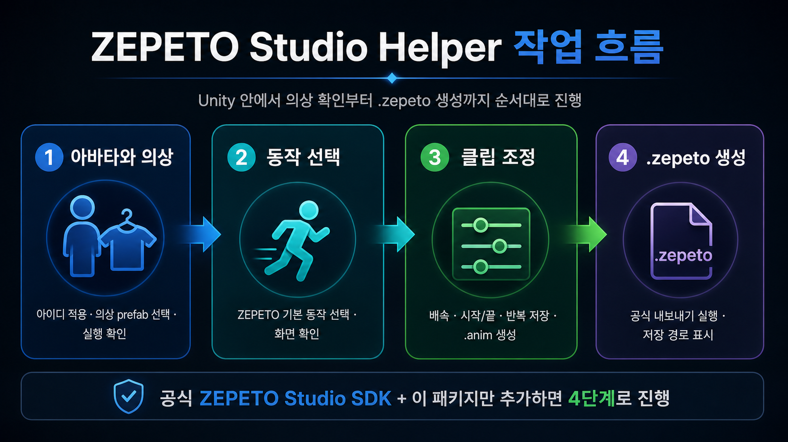

<div align="center">

# ZEPETO Studio Helper

ZEPETO Studio 의상 확인부터 `.zepeto` 생성까지 Unity 안에서 순서대로 진행하게 해주는 에디터 도우미 패키지

[](https://unity.com/)
[](https://studio.zepeto.me/)
[](package.json)
[](Documentation~/QA_AUDIT.md)

공식 `ZEPETO Studio SDK`가 설치된 Unity 프로젝트에 이 패키지만 추가하면,  
아바타/의상 확인, 동작 선택, 클립 조정, `.zepeto` 생성 흐름을 4단계로 진행할 수 있습니다.



</div>

## 결론부터

질문했던 “공식 Unity ZEPETO에서 제공하는 것 + 내가 제공하는 helper만 쓰면 바로 동작하냐”에 대한 답은 **조건부로 맞습니다**.

필요한 것은 아래 두 가지입니다.

- 공식 `ZEPETO Studio SDK`
- 이 저장소의 `com.easy.zepeto-helper` 패키지

다만 이 helper는 ZEPETO SDK를 대신 설치하거나, ZEPETO 계정 로그인/업로드 심사를 대신하지 않습니다.  
Unity 프로젝트 안에서 헷갈리는 작업 순서와 파일 저장 위치를 정리해주는 에디터 창입니다.

## 이 패키지가 해주는 일

- `LOADER`에서 ZEPETO 아이디와 의상 prefab 상태 확인
- `Assets/Contents` 아래 의상 prefab 선택
- ZEPETO 기본 동작 선택과 미리보기
- 배속, 시작 시간, 끝 시간, 반복 설정을 새 `.anim` 파일로 저장
- 공식 ZEPETO 내보내기 메뉴 실행
- 최종 `.zepeto` 파일 저장 위치를 화면에 표시
- 완료된 단계는 잠그고, 수정할 때만 다시 열도록 안내

## 작업 흐름

| 단계 | 목적 | 결과 |
| --- | --- | --- |
| 1. 아바타와 의상 | 아이디 적용, 의상 prefab 선택, 실행 확인 | 아바타와 의상이 준비됨 |
| 2. 동작 선택 | ZEPETO 기본 동작 선택, 화면 확인 | 작업용 동작 복사본이 `LOADER`에 연결됨 |
| 3. 클립 조정 | 배속, 시작/끝, 반복 저장 | 새 `.anim` 파일이 생성됨 |
| 4. `.zepeto` 생성 | 공식 내보내기 실행, 저장 경로 표시 | 업로드 가능한 `.zepeto` 파일 생성 |

## 검증한 환경

| 항목 | 값 |
| --- | --- |
| 운영체제 | Windows 11 |
| Unity | `2020.3.9f1` |
| ZEPETO Studio | `3.2.12` |
| 패키지 이름 | `com.easy.zepeto-helper` |
| 패키지 버전 | `0.2.0` |
| ZEPETO registry | `https://upm.zepeto.run` |

자세한 환경 설정은 [docs/ENVIRONMENT.md](docs/ENVIRONMENT.md)에 정리했습니다.

## 설치 방법 1: Unity Package Manager에서 Git 주소로 설치

Unity에서 직접 설치하는 가장 쉬운 방식입니다.

1. Unity 프로젝트 열기
2. 상단 메뉴에서 `Window > Package Manager` 열기
3. 왼쪽 위 `+` 버튼 클릭
4. `Add package from git URL...` 선택
5. 아래 주소 입력

```text
https://github.com/RURUGURU/zepeto_studio_helper.git
```

6. 설치 후 아래 메뉴 열기

```text
Window > Easy > ZEPETO Studio Helper
```

## 설치 방법 2: `manifest.json`에 직접 추가

Unity 프로젝트의 `Packages/manifest.json`을 직접 수정할 때는 아래처럼 넣습니다.

```json
{
  "dependencies": {
    "com.easy.zepeto-helper": "https://github.com/RURUGURU/zepeto_studio_helper.git",
    "zepeto.studio": "3.2.12"
  },
  "scopedRegistries": [
    {
      "name": "ZEPETO",
      "url": "https://upm.zepeto.run",
      "scopes": [
        "zepeto"
      ]
    }
  ]
}
```

이미 `dependencies`와 `scopedRegistries`가 있다면, 기존 내용을 지우지 말고 필요한 줄만 추가하세요.

## 설치 방법 3: 로컬 tarball로 설치

이 저장소를 내려받아 `.tgz` 패키지 파일로 만든 뒤 설치할 수도 있습니다.

```powershell
git clone https://github.com/RURUGURU/zepeto_studio_helper.git
cd zepeto_studio_helper
npm pack
```

생성되는 파일 예시:

```text
com.easy.zepeto-helper-0.2.0.tgz
```

Unity에서 설치:

1. `Window > Package Manager`
2. `+`
3. `Add package from tarball...`
4. 생성된 `.tgz` 선택

현재 검증된 로컬 산출물 경로:

```text
Build/Packages/com.easy.zepeto-helper-0.2.0.tgz
```

## 공식 ZEPETO SDK 설정

ZEPETO 패키지가 아직 설치되지 않은 프로젝트라면 `Packages/manifest.json`에 registry가 있어야 합니다.

```json
{
  "scopedRegistries": [
    {
      "name": "ZEPETO",
      "url": "https://upm.zepeto.run",
      "scopes": [
        "zepeto"
      ]
    }
  ],
  "dependencies": {
    "zepeto.studio": "3.2.12"
  }
}
```

Unity가 패키지를 다시 읽게 하려면:

```text
Assets > Refresh
```

또는 Unity를 다시 열어도 됩니다.

## Unity 안에서 실제 사용 순서

1. ZEPETO용 Unity 프로젝트를 엽니다.
2. 의상 prefab을 `Assets/Contents` 아래에 둡니다.
3. ZEPETO `LOADER`가 있는 scene을 엽니다.
4. 아래 메뉴를 엽니다.

```text
Window > Easy > ZEPETO Studio Helper
```

5. `1. 아바타와 의상`에서 아이디와 의상을 확인합니다.
6. `Play로 저장 결과 확인` 또는 단계별 실행 버튼으로 화면을 확인합니다.
7. `2. 동작 선택`에서 기본 동작을 고르고 적용합니다.
8. `3. 클립 조정`에서 배속, 시작/끝, 반복을 조정합니다.
9. 파란 `3번 적용 / 저장 후 다음 단계` 버튼을 누릅니다.
10. `4. .zepeto 생성`에서 최종 확인 후 파란 버튼을 누릅니다.
11. 화면의 `출력 파일` 줄에서 저장 경로를 확인합니다.

## 생성되는 파일 위치

| 종류 | 위치 |
| --- | --- |
| 작업용 동작 복사본 | `Assets/ZepetoHelper/Animations` |
| 클립 조정 결과 | `Assets/ZepetoHelper/Animations/ClipEdits` |
| 임시 미리보기 clip | `Assets/ZepetoHelper/Animations/Preview/clip_adjust_preview.anim` |
| 최종 `.zepeto` 파일 | 의상 prefab이 있는 폴더 |

최종 파일명 예시:

```text
ZEPETO_TRANSPARENT_1_VideoBooth_139_v02.zepeto
```

검증된 실제 출력 예시:

```text
Assets/Contents/TRANSPARENT_1/ZEPETO_TRANSPARENT_1_VideoBooth_139_v02.zepeto
```

## 개발자가 다시 패키징할 때 쓰는 명령어

패키지 폴더로 이동:

```powershell
cd C:\Users\Jun-WN\Desktop\zepeto\zepeto-studio-unity-3.2.12\Packages\com.easy.zepeto-helper
```

패키지 내용 확인:

```powershell
npm pack --dry-run --json
```

실제 `.tgz` 생성:

```powershell
npm pack
```

프로젝트 산출물 폴더로 옮기기:

```powershell
New-Item -ItemType Directory -Force -Path ..\..\Build\Packages
Move-Item -Force .\com.easy.zepeto-helper-0.2.0.tgz ..\..\Build\Packages\com.easy.zepeto-helper-0.2.0.tgz
```

압축 파일 안에 들어간 파일 확인:

```powershell
tar -tzf ..\..\Build\Packages\com.easy.zepeto-helper-0.2.0.tgz
```

## GitHub에 처음 올릴 때 쓴 명령어

패키지 폴더에서 실행합니다.

```powershell
cd C:\Users\Jun-WN\Desktop\zepeto\zepeto-studio-unity-3.2.12\Packages\com.easy.zepeto-helper
git init
git add -A
git commit -m "Publish ZEPETO Studio helper package"
git branch -M main
git remote add origin https://github.com/RURUGURU/zepeto_studio_helper.git
git push -u origin main
```

이미 `origin`이 있으면 아래처럼 교체합니다.

```powershell
git remote remove origin
git remote add origin https://github.com/RURUGURU/zepeto_studio_helper.git
git push -u origin main
```

상태 확인:

```powershell
git status -sb
git log --oneline -3
git remote -v
git ls-remote origin refs/heads/main
```

## 검증 명령어

Unity console에서 C# 오류 확인:

```text
Console 검색어: ZepetoStudioHelperWindow.cs
Console 검색어: error CS
```

레거시 모션/포즈 코드가 남아 있는지 확인:

```powershell
rg -n "PoseEdit|MotionEdit|Motion Adjust|모션 조정|shallow pose" .\Editor\ZepetoStudioHelperWindow.cs .\package.json .\README.md
```

기대 결과: 출력 없음.

패키지 metadata 확인:

```powershell
Get-Content .\package.json
```

## 이 패키지가 하지 않는 것

- ZEPETO Studio SDK 자체 설치 대체
- ZEPETO 계정 로그인 대체
- 업로드 심사 대체
- Maya, Blender에서 해야 하는 mesh/rig 수정
- 옷 관통 문제를 자동으로 해결하는 물리 시뮬레이션

이 패키지는 공식 SDK 위에서 동작하는 Unity Editor 작업 보조 도구입니다.

## QA / Audit

상세 검증 기록은 [Documentation~/QA_AUDIT.md](Documentation~/QA_AUDIT.md)에 있습니다.
