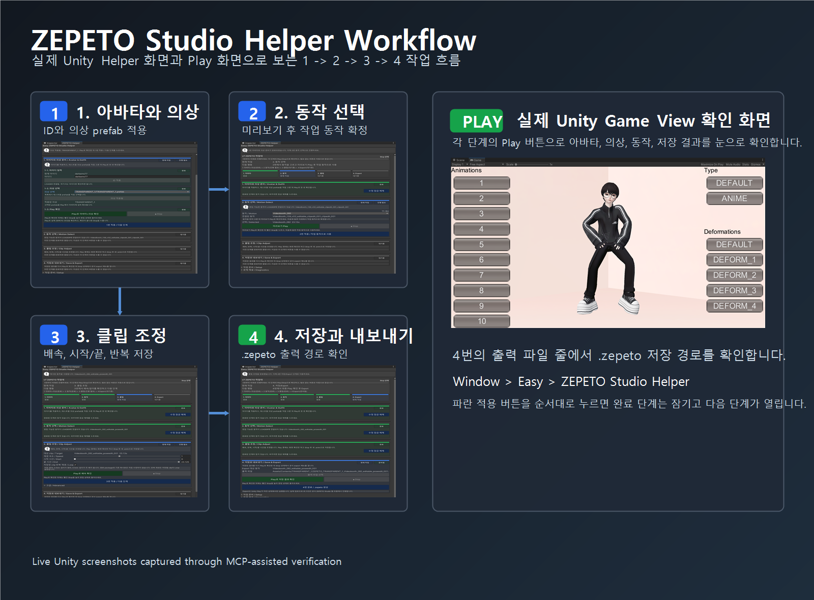
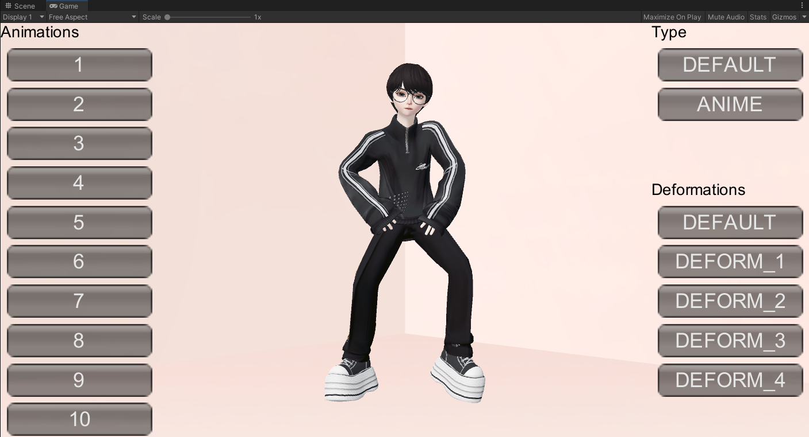
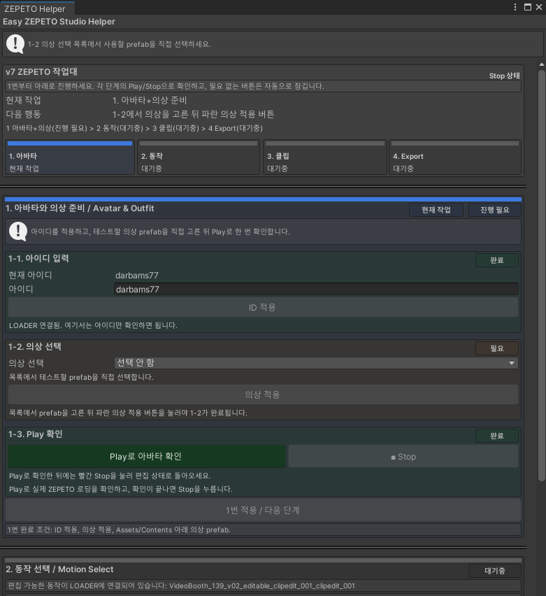
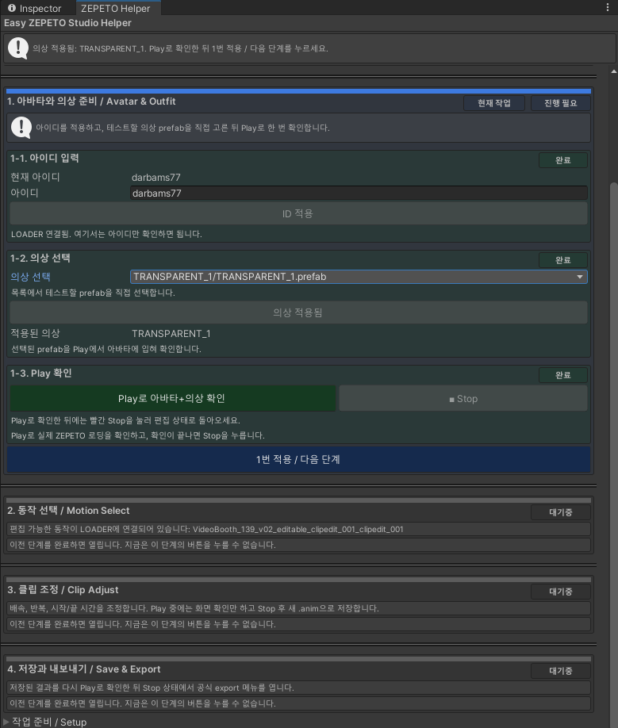
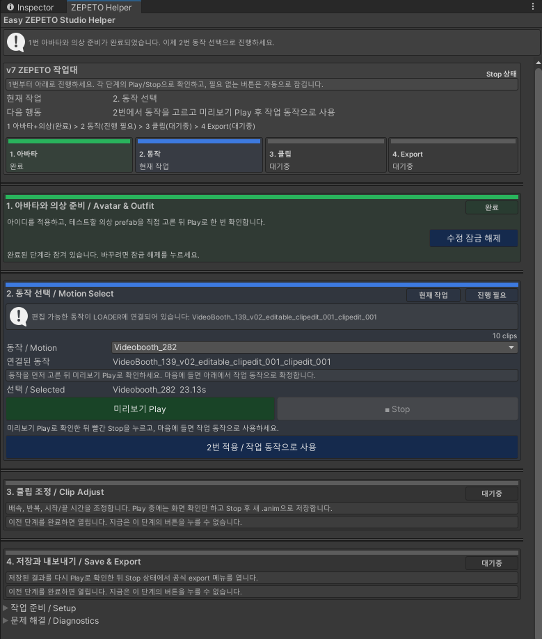
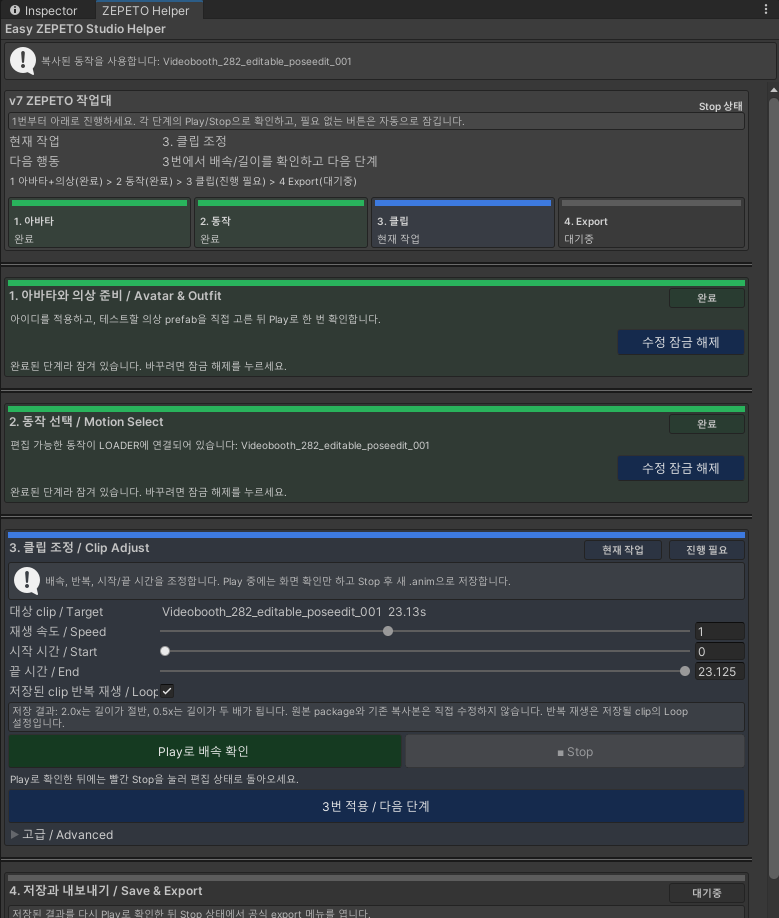
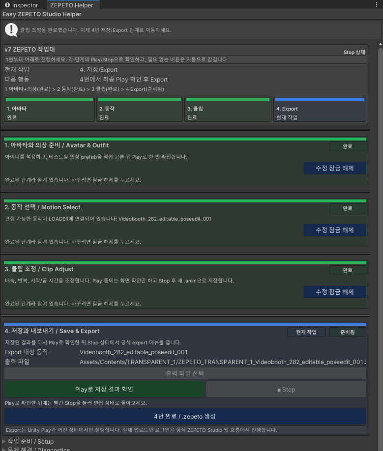

<div align="center">

# ZEPETO Studio Helper

처음 쓰는 사람도 Unity 안에서 `1 -> 2 -> 3 -> 4` 순서대로 누르면
의상 확인, 동작 선택, 클립 저장, `.zepeto` 생성까지 끝낼 수 있게 만든 ZEPETO Studio 작업대

[](https://unity.com/)
[](https://studio.zepeto.me/)
[](package.json)
[](#처음-사용하는-순서)
[](Documentation~/QA_AUDIT.md)



### 실제 Play 확인 화면

Helper의 `Play` 버튼을 누르면 Unity `Game View`에서 아래처럼 아바타, 의상, 동작 상태를 바로 확인합니다.



<details>
<summary>전체 Helper 창 보기</summary>



</details>

</div>

## 한 줄 요약

공식 ZEPETO Studio SDK 프로젝트에 이 패키지를 추가한 뒤, Unity 메뉴에서 아래 창을 열고 파란 적용 버튼만 순서대로 누르면 됩니다.

```text
Window > Easy > ZEPETO Studio Helper
```

## 처음 보는 사람용 체크리스트

| 확인 | 어디서 보나요 | 되어 있으면 |
| --- | --- | --- |
| ZEPETO SDK가 설치됨 | `Packages/manifest.json` 또는 Package Manager | `zepeto.studio`가 보임 |
| helper가 설치됨 | Package Manager | `com.easy.zepeto-helper`가 보임 |
| 작업 scene이 열림 | Unity Hierarchy | `LOADER`가 보임 |
| 의상 prefab이 있음 | Project 창 | `Assets/Contents/.../*.prefab`이 보임 |
| helper 창이 열림 | Unity 상단 메뉴 | `Window > Easy > ZEPETO Studio Helper` |

`helper 창이 열림`까지 확인되면 바로 아래 순서대로 진행하면 됩니다. `helper가 설치됨`이 보이지 않으면 먼저 설치 방법으로 내려가세요.

## 내 상황별 빠른 길

| 지금 상태 | 바로 할 일 |
| --- | --- |
| ZEPETO SDK 프로젝트가 이미 있음 | `설치 방법`에서 Git URL로 helper 추가 |
| helper 설치는 끝났는데 창을 못 찾겠음 | `Window > Easy > ZEPETO Studio Helper` 열기 |
| 창은 열렸는데 1번에서 막힘 | `LOADER`가 있는 scene인지 확인 |
| 의상 선택 목록이 비어 있음 | 의상 prefab을 `Assets/Contents` 아래로 옮기기 |
| export 후 파일 위치를 모르겠음 | 4번 단계의 `출력 파일` 줄 확인 |

## 처음 사용하는 순서

| 순서 | 화면에서 누를 것 | 끝난 상태 |
| --- | --- | --- |
| 1 | `1-1. 아이디 입력`에서 `ID 적용` | 내 ZEPETO 아이디가 `LOADER`에 들어감 |
| 2 | `1-2. 의상 선택`에서 prefab 선택 후 `의상 적용` | 아바타에 의상이 입혀짐 |
| 3 | `1-3. Play 확인`으로 화면 확인 후 Stop | 의상 상태를 눈으로 확인함 |
| 4 | 파란 `1번 적용 / 다음 단계` | 1번이 잠기고 2번으로 이동 |
| 5 | `2. 동작 선택`에서 동작 고르고 `미리보기 Play` | 춤/동작을 화면에서 확인함 |
| 6 | Stop 후 파란 `2번 적용 / 작업 동작으로 사용` | 선택한 동작이 작업용 clip이 됨 |
| 7 | `3. 클립 조정`에서 배속, 시작, 끝, 반복 조정 | 저장할 clip 모양이 정해짐 |
| 8 | `Play로 저장 결과 확인` 후 파란 `3번 적용 / 저장 후 다음 단계` | 새 `.anim` 파일이 저장됨 |
| 9 | `4. 저장과 내보내기`에서 `Play로 저장 결과 확인` | 최종 동작을 다시 확인함 |
| 10 | 파란 `4번 완료 / .zepeto 생성` | `.zepeto` 파일이 생성됨 |
| 11 | `출력 파일` 줄 확인 | 저장된 파일 위치를 알 수 있음 |

중간에 다시 고치고 싶으면 해당 단계의 `수정 잠금 해제`를 누른 뒤 다시 적용하면 됩니다.

## 실제 화면으로 따라하기

### 1. 아바타와 의상

ID를 확인하고, `Assets/Contents` 아래 의상 prefab을 선택한 뒤 `의상 적용`과 `1번 적용 / 다음 단계`를 누릅니다.



### 2. 동작 선택

동작을 고르고 `미리보기 Play`로 확인한 뒤 `2번 적용 / 작업 동작으로 사용`을 누릅니다.



### 3. 클립 조정

배속, 시작 시간, 끝 시간, 반복 여부를 조정하고 `Play로 배속 확인` 후 `3번 적용 / 저장 후 다음 단계`를 누릅니다.



### 4. 저장과 내보내기

최종 결과를 다시 Play로 확인한 뒤 `4번 완료 / .zepeto 생성`을 누르고 `출력 파일` 줄의 경로를 확인합니다.



### Play 화면

각 단계의 Play 버튼을 누르면 실제 Game View에서 아바타와 의상, 동작 상태를 확인합니다.


## 설치 방법

### 가장 쉬운 설치

Unity에서 아래 순서대로 클릭합니다.

1. `Window > Package Manager`
2. 왼쪽 위 `+`
3. `Add package from git URL...`
4. 아래 주소 붙여넣기

```text
https://github.com/RURUGURU/zepeto_studio_helper.git
```

설치가 끝나면 아래 메뉴가 생깁니다.

```text
Window > Easy > ZEPETO Studio Helper
```

### manifest.json으로 설치

Unity 프로젝트의 `Packages/manifest.json`에 필요한 줄만 추가합니다.

```json
{
  "dependencies": {
    "com.easy.zepeto-helper": "https://github.com/RURUGURU/zepeto_studio_helper.git",
    "zepeto.studio": "3.2.12"
  },
  "scopedRegistries": [
    {
      "name": "ZEPETO",
      "url": "https://upm.zepeto.run",
      "scopes": [
        "zepeto"
      ]
    }
  ]
}
```

이미 `dependencies`나 `scopedRegistries`가 있다면 전체 파일을 덮어쓰지 말고 위 항목만 합쳐 넣습니다.

### tarball로 설치

GitHub가 아니라 파일로 설치하고 싶을 때 사용합니다.

```powershell
git clone https://github.com/RURUGURU/zepeto_studio_helper.git
cd zepeto_studio_helper
npm pack
```

생성되는 파일:

```text
com.easy.zepeto-helper-0.2.4.tgz
```

Unity에서는 `Window > Package Manager > + > Add package from tarball...`을 누르고 `.tgz` 파일을 선택합니다.

## 버튼 이름이 헷갈릴 때

| 버튼 | 뜻 |
| --- | --- |
| `Play` | Unity 화면에서 실제 아바타와 동작을 확인 |
| `Stop` | 확인을 끝내고 편집 가능한 상태로 돌아옴 |
| `적용` | 지금 선택한 값을 helper가 작업 상태로 저장 |
| `다음 단계` | 현재 단계가 끝났으니 다음 번호를 열기 |
| `수정 잠금 해제` | 이미 완료한 단계를 다시 바꾸기 |
| `.zepeto 생성` | 공식 ZEPETO export를 실행하고 결과 파일 경로 표시 |

## 저장되는 파일

| 파일 | 저장 위치 | 언제 생기나요 |
| --- | --- | --- |
| 작업용 동작 복사본 | `Assets/ZepetoHelper/Animations` | 2번 적용 후 |
| 조정된 clip | `Assets/ZepetoHelper/Animations/ClipEdits` | 3번 적용 후 |
| 임시 미리보기 clip | `Assets/ZepetoHelper/Animations/Preview/clip_adjust_preview.anim` | Play 확인 중 |
| 최종 `.zepeto` | 의상 prefab이 있는 폴더 | 4번 생성 후 |

최종 파일명 예시:

```text
ZEPETO_TRANSPARENT_1_VideoBooth_139_v02.zepeto
```

검증된 실제 출력 예시:

```text
Assets/Contents/TRANSPARENT_1/ZEPETO_TRANSPARENT_1_VideoBooth_139_v02.zepeto
```

## 막혔을 때 먼저 볼 곳

| 증상 | 먼저 확인할 것 |
| --- | --- |
| helper 메뉴가 안 보임 | Package Manager에 `com.easy.zepeto-helper`가 설치됐는지 확인 |
| `LOADER` 연결 안내가 나옴 | ZEPETO용 scene을 열었는지 확인 |
| 의상 목록이 비어 있음 | prefab이 `Assets/Contents` 아래에 있는지 확인 |
| Play가 비활성화됨 | 빨간 Stop 상태라면 Stop을 먼저 누름 |
| `.zepeto`가 안 보임 | 4번의 `출력 파일` 줄과 Unity Console 확인 |

## 검증한 환경

| 항목 | 값 |
| --- | --- |
| 운영체제 | Windows 11 |
| Unity | `2020.3.9f1` |
| ZEPETO Studio | `3.2.12` |
| 패키지 이름 | `com.easy.zepeto-helper` |
| 패키지 버전 | `0.2.4` |
| ZEPETO registry | `https://upm.zepeto.run` |

환경 설정 상세는 [docs/ENVIRONMENT.md](docs/ENVIRONMENT.md), 검증 기록은 [Documentation~/QA_AUDIT.md](Documentation~/QA_AUDIT.md)에 정리되어 있습니다.

## 개발자 명령어

패키지 폴더로 이동:

```powershell
cd C:\Users\Jun-WN\Desktop\zepeto\zepeto-studio-unity-3.2.12\Packages\com.easy.zepeto-helper
```

패키지 내용 확인:

```powershell
npm pack --dry-run --json
```

실제 `.tgz` 생성:

```powershell
npm pack
```

산출물 폴더로 이동:

```powershell
New-Item -ItemType Directory -Force -Path ..\..\Build\Packages
Move-Item -Force .\com.easy.zepeto-helper-0.2.4.tgz ..\..\Build\Packages\com.easy.zepeto-helper-0.2.4.tgz
```

압축 파일 내용 확인:

```powershell
tar -tzf ..\..\Build\Packages\com.easy.zepeto-helper-0.2.4.tgz
```
