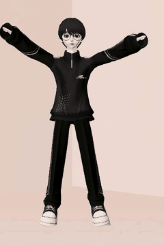
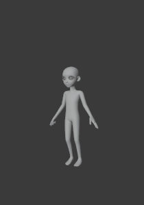
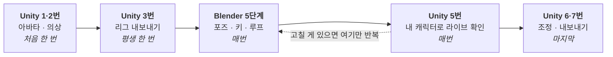
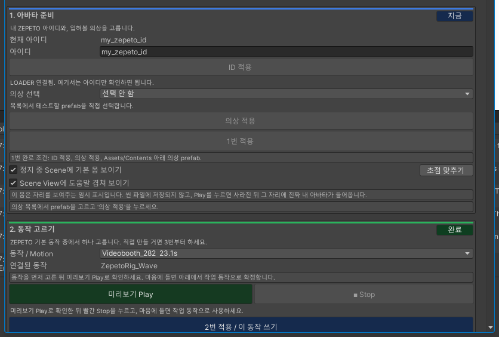
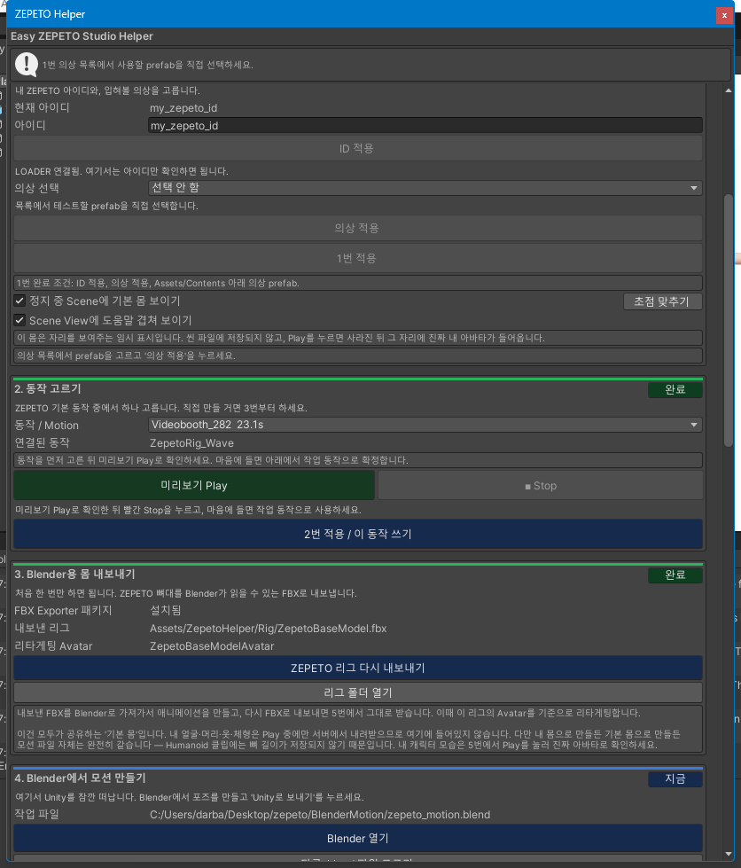
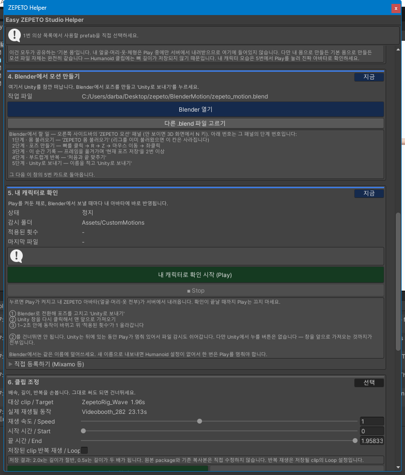
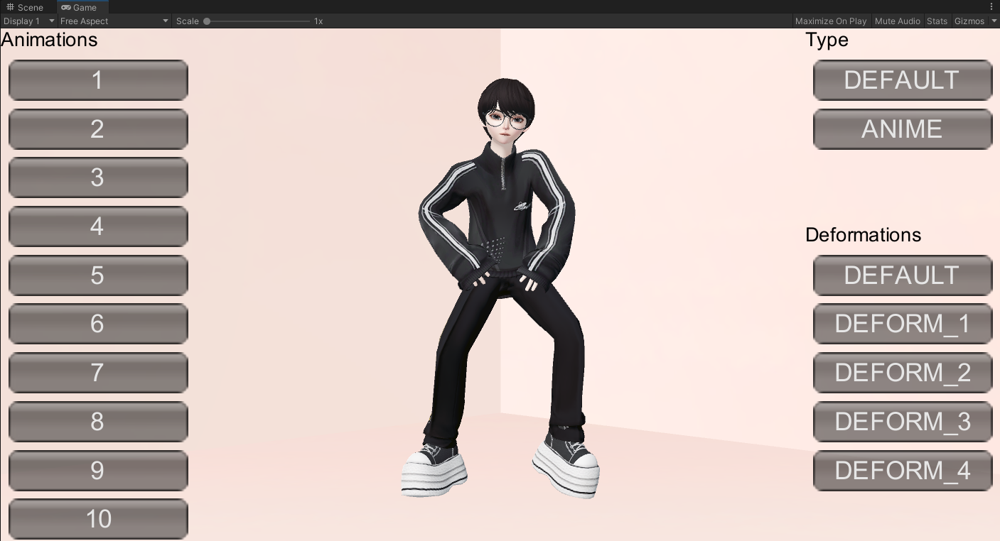

<div align="center">

# ZEPETO 모션 파이프라인

Blender에서 춤을 만들어 Unity의 내 ZEPETO 아바타 위에서 바로 확인하는 작업대.
**Blender 버튼 다섯 개 → Unity 창 클릭.** 그게 한 사이클 전부입니다.


&nbsp;&nbsp;


왼쪽은 Unity Play 중 서버에서 내려온 **실제 ZEPETO 아바타**, 오른쪽은 같은 안무를 Blender에서
렌더한 것입니다. 10초 · 20비트 @ 120 BPM.
`BlenderMotion/make_dance.py`로 이 안무를 그대로 다시 만들 수 있습니다.

</div>

---

## ⚠️ 먼저 알아야 할 것 — 모션은 아이템으로 못 올립니다

제페토 스튜디오에 **모션 카테고리가 없습니다.** 업로드 가능한 항목은 전부 착용 아이템(옷·헤어·신발·
가방)입니다. 앱 안의 포즈·제스처는 제페토 서버의 공식 라이브러리에서만 오기 때문에, 내가 만든 동작을
그 목록에 넣을 방법이 없습니다.

| 하고 싶은 것 | 되나요 | 어떻게 |
| --- | --- | --- |
| 내 옷이 **움직일 때** 어떻게 보이는지 확인 | **됩니다** | 이 저장소 전체가 그것입니다 |
| 그 **옷**을 스튜디오에 올리기 | **됩니다** | 헬퍼 7번 → `.zepeto` → 스튜디오 웹 |
| 그 **모션**을 스튜디오에 올리기 | **안 됩니다** | 카테고리 자체가 없습니다 |
| 그 **모션**을 남에게 보여주기 | **됩니다** | **ZEPETO World** — 유일한 공식 목적지 |

근거와 확인 방법은 [`STATUS.md`](STATUS.md)의 `모션은 아이템으로 못 올립니다` 절에 있습니다.
헬퍼 7번 카드 안에서도 같은 내용을 안내하고 문서 링크 버튼을 제공합니다.

---

## 무엇이 들어 있나

| 폴더 | 무엇 |
| --- | --- |
| [`BlenderMotion/`](BlenderMotion/) | Blender 애드온 + 초보자 가이드 + 검사 스크립트 |
| `unity-project/` | ZEPETO Studio 아이템 제작 템플릿 (SDK 3.2.16) |
| └ `Packages/com.easy.zepeto-helper/` | Unity 헬퍼 패키지 — 7단계 창, 라이브 미리보기, 자체 문서 |
| └ `Assets/ZepetoHelperTests/` | Unity 자체 테스트 + 러너 4개 |
| `Capoeira.fbx` (루트) | Mixamo 샘플 2.1MB. **파이프라인은 쓰지 않습니다.** 헬퍼 5번의 `직접 등록하기`로 외부 FBX를 넣어 볼 때 쓸 수 있는 연습용 파일입니다 |

## 설치 — 처음부터 순서대로

### 1. Unity 2020.3.9f1

[Unity Hub](https://unity.com/download)를 설치한 뒤, Hub의 `Installs > Install Editor >
Archive > download archive`에서 **2020.3.9f1**을 고릅니다. 최신 LTS가 아니라 이 버전이어야 합니다 —
ZEPETO SDK 3.2.16이 이 버전에 맞춰져 있습니다.

> Unity Personal 라이선스로 충분합니다.

### 2. Blender 4.2 이상

[blender.org](https://www.blender.org/download/)에서 받습니다. 애드온이 요구하는 최소 버전은
**4.2**이고, **5.2.0 LTS**에서 동작을 확인했습니다.

이 문서의 모든 Blender 명령은 **PowerShell** 기준이고 아래 `$B` 변수를 씁니다. 창을 새로 열 때마다
한 번 정의하세요. **설치한 버전이 5.2가 아니면 경로의 `Blender 5.2`를 본인 버전으로 바꾸세요.**

```powershell
$B = "C:\Program Files\Blender Foundation\Blender 5.2\blender.exe"
```

> Git Bash를 쓰신다면 `$B="/c/Program Files/Blender Foundation/Blender 5.2/blender.exe"` 로 두고
> 명령의 `\`를 `/`로 바꾸세요. Bash에서 `\`는 이스케이프 문자라 `BlenderMotion\install_addon.py`가
> `BlenderMotioninstall_addon.py`가 됩니다.

### 3. 클론

```bash
git clone https://github.com/RURUGURU/zepeto_studio_helper.git
cd zepeto_studio_helper
```

**한 번이면 됩니다.** Unity 헬퍼 패키지도 이 안에 들어 있습니다
(`unity-project/Packages/com.easy.zepeto-helper/`).


### 4. Blender 애드온 설치

저장소 폴더 안에서 실행합니다.

```powershell
& $B --background --python BlenderMotion\install_addon.py
```

> **맨 앞의 `&`를 빼면 안 됩니다.** PowerShell은 따옴표로 시작하는 줄을 명령이 아니라 문자열로 읽어서
> `The '--' operator works only on variables` 파서 에러를 냅니다. `$B`를 정의하지 않았다면 위
> **2. Blender** 로 돌아가세요.

`PASS :: 설치 완료` 두 줄이 나오면 끝입니다. 설치·활성화·설정 저장까지 한 번에 합니다.
손으로 하시려면 Blender의 `Edit > Preferences > Add-ons > Install from Disk`로
`BlenderMotion\zepeto_motion_helper.py`를 고르셔도 됩니다.

> **Blender의 설치는 복사입니다.** `zepeto_motion_helper.py`를 고친 뒤에는 위 명령을 다시 돌리세요.
> 안 그러면 낡은 사본이 계속 돕니다 — 에러가 안 나서 스스로는 드러나지 않습니다.
> `headless_check.py`의 `install:copy-matches-source`가 그 상태를 잡습니다.

### 5. Unity 프로젝트 열기

Unity Hub에서 `Add > Add project from disk`로 `unity-project` 폴더를
고릅니다. 열리면 상단 메뉴 **`Window > Easy > ZEPETO Studio Helper`** 로 헬퍼 창을 띄웁니다.

헬퍼 패키지는 `Packages/` 안에 들어 있으므로(embedded) Unity가 알아서 인식합니다. **따로 설치할 것이
없습니다.** 다른 Unity 프로젝트에 이 패키지만 넣고 싶다면 패키지 README의
[`설치 방법`](unity-project/Packages/com.easy.zepeto-helper/README.md#설치-방법)
절을 보세요.

### 6. 내 제페토 아이디 넣기

헬퍼 **1번** 카드의 `아이디` 칸에 본인 아이디를 넣고 `ID 적용`. 5번의 라이브 확인이 이 아이디로
아바타를 내려받으므로, 이걸 안 하면 Play를 눌러도 아바타가 나타나지 않습니다.

---

## 사용법 — 전체 그림


```mermaid
flowchart LR
    A["<b>Unity 1·2번</b><br/>아바타 · 의상<br/><i>처음 한 번</i>"]
    B["<b>Unity 3번</b><br/>리그 내보내기<br/><i>평생 한 번</i>"]
    C["<b>Blender 5단계</b><br/>포즈 · 키 · 루프<br/><i>매번</i>"]
    D["<b>Unity 5번</b><br/>내 캐릭터로 라이브 확인<br/><i>매번</i>"]
    E["<b>Unity 6·7번</b><br/>조정 · 내보내기<br/><i>마지막</i>"]
    A --> B --> C --> D --> E
    D -. "고칠 게 있으면 여기만 반복" .-> C
```

**한 사이클은 Blender 버튼 하나 + Unity 창 클릭입니다.** 5번의 초록 버튼으로 Play를 켜 두면,
Blender에서 `Unity로 보내기`를 누르고 Unity 창을 다시 클릭할 때마다 1~2초 안에 내 아바타에
반영됩니다. Play를 끄지 않습니다.

---

## 따라하기 — 화면 그대로

아래 캡처는 전부 **실제로 돌아가는 화면**입니다. 합성이나 목업이 아니고, Blender 쪽 5장은
애드온 오퍼레이터로 조작하면서 찍은 것이라 여러분 화면과 같은 것이 나옵니다.

### Unity 1번 — 아이디와 의상

`아이디` 칸에 본인 제페토 아이디를 넣고 **`ID 적용`**, `Assets/Contents` 아래 의상 prefab을 골라
**`의상 적용`**. 5번의 라이브 확인이 이 아이디로 아바타를 내려받으므로 여기를 먼저 채워야 합니다.



### Unity 2번 — 동작 고르기

ZEPETO 기본 동작 목록입니다. 직접 만들 거면 건너뛰고 3번으로 갑니다. 목록의 `[내 모션]` 표시가
내가 만든 것, `(포즈)`는 키가 1개뿐이라 정지 화면인 것입니다.



### Unity 3번 — Blender용 몸 내보내기 (평생 한 번)

`ZEPETO 리그 내보내기`를 누르면 `Assets/ZepetoHelper/Rig/ZepetoBaseModel.fbx`가 만들어집니다.
ZEPETO의 진짜 뼈 이름과 rest pose 위에서 작업하기 위한 파일이라, 이걸 건너뛰면 Unity에서
Humanoid 매핑이 깨집니다.

---

### Blender 1단계 — 몸 불러오기

`zepeto_motion.blend`를 열고 3D 화면에서 **N** 키를 누르면 오른쪽에 `ZEPETO 모션` 패널이 나옵니다.
맨 위 줄이 **`쓸 수 있는 뼈 54개 / 전체 103개`** 입니다.


> 뼈는 103개인데 54개만 보입니다. 나머지 49개(`*Twist*` · `*_scale` · 얼굴 대부분)는 Unity Humanoid에
> 매핑이 없어서 **돌려도 조용히 사라지므로** 애드온이 아예 클릭을 막아 둡니다.

### Blender 2단계 — 포즈 만들기

파란 막대가 뼈입니다. 뼈를 클릭 → **R** → 마우스 → **좌클릭**. 몸통 메시는 클릭이 막혀 있어서
마우스는 항상 뼈에 떨어집니다.


> ⚠️ **회전(R)만 쓰세요.** 이동(G)·크기(S)는 Humanoid 리타게팅이 통째로 버립니다.
> Blender에서는 잘 보이는데 Unity에서 안 나오는 원인 1위입니다.

### Blender 3단계 — 이 순간 기록

프레임을 정하고 **`현재 포즈 저장`**. 3단계 칸에 `저장된 프레임: 1, 24`가 쌓이고 아래 타임라인에도
키가 마름모로 찍힙니다. **최소 2개**가 필요하고, 두 프레임의 포즈가 같으면 애드온이 거절합니다.


### Blender 4단계 — 부드럽게 반복

**`처음과 끝 맞추기`** 한 번. 1프레임 포즈가 마지막 프레임에 복사되어 반복 재생에서 툭 끊기지
않습니다. ZEPETO 안에서는 동작이 계속 반복되므로 사실상 필수입니다.


### Blender 5단계 — Unity로 보내기

이름을 정하고 **`Unity로 보내기`**. 조건이 안 맞으면 버튼이 회색이고 **그 위에 이유가 한국어로**
하나씩 적힙니다. 다 맞으면 **`보낼 준비 완료`** 로 바뀝니다 — 아래가 그 상태입니다.


> `저장 폴더`가 처음엔 비어 있습니다. 고장이 아닙니다 — `.blend`에 절대 경로를 저장해 두지 않기
> 때문이고(다른 컴퓨터에서 열면 없는 폴더가 됩니다), 바로 아래 **`경로 자동 찾기`** 를 한 번 누르면
> 채워집니다.

---

### Unity 5번 — 내 캐릭터로 확인

초록 **`내 캐릭터로 확인 시작 (Play)`**. Play가 켜지고 내 실제 아바타가 서버에서 내려옵니다.
**Play를 끄지 마세요.** Blender에서 `Unity로 보내기`를 누른 뒤 **Unity 창을 다시 클릭**하면
1~2초 안에 동작이 바뀌고 `적용된 횟수`가 올라갑니다.



그 결과가 이것입니다 — 위에 있는 GIF와 같은 화면입니다.



### Unity 6번 — 클립 조정

속도·구간을 다듬습니다. 원본은 건드리지 않고 `_editable` 사본을 만들어 작업합니다.


### Unity 7번 — 내보내기

`.zepeto`를 만듭니다. **여기에 모션은 안 들어갑니다** — 맨 위 경고를 다시 보세요. 이 카드 안의
`이 모션을 제페토에 넣기` 패널이 ZEPETO World로 가는 4단계를 안내합니다.


---

## 얼굴 — 지금 되는 것과, 왜 깜빡임이 없는지

**결론부터.** 이 파이프라인이 지금 만들 수 있는 얼굴 움직임은 **눈동자 방향**과 **입(턱) 벌리기**
둘뿐입니다. **눈 깜빡임과 표정은 만들지 못합니다** — 다만 그건 제페토가 못 해서가 아니라,
우리가 Blender로 내보내는 몸에 그 기능이 들어 있지 않기 때문입니다.

### 확인한 사실

세 가지를 실제로 열어 봤습니다.

| 무엇 | 결과 |
| --- | --- |
| **공식 SDK의 기본 몸** (`zepeto.character@3.1.32`의 `ZepetoBaseModel.prefab`) | 블렌드셰이프 **0개** (`m_Shapes: vertices: [] shapes: [] channels: []`, 메시 4개 전부) |
| **공식 제페토 모션 클립** (`zepeto.studio@3.2.16`의 `ANI_039_v03.anim`) | 블렌드셰이프 커브 **57종**. `attribute: blendShape.zepeto.eyeBlinkLeft`, `path: body`, `classID: 137` |
| **Play 중 실제 내 아바타** | `body` 메시(`SHARED_MESH`)에 블렌드셰이프 **250개**. 그중 깜빡임·눈썹·미소 계열이 **79개** (`zepeto.eyeBlinkLeft` · `zepeto.mouthSmileLeft` · `zepeto.browInnerUp` …) |

즉 **제페토 아바타는 깜빡입니다.** 공식 모션도 깜빡입니다. Unity 애니메이션 클립도 그 커브를
담을 수 있습니다. 안 되는 곳은 딱 하나, **Blender로 내보낸 기본 몸**입니다.

> 위 표의 숫자는 전부 파일을 직접 읽어 얻은 것입니다. 마지막 줄은
> `unity-project/Assets/ZepetoHelperTests/Editor/ZepetoFaceProbeRun.cs`가 Play 중에 재는 값이라,
> 직접 돌려서 확인할 수 있습니다.

### 왜 Blender에서는 못 하나

블렌드셰이프는 **모델에 미리 만들어 둔 표정 모양**입니다. 뼈처럼 돌리는 게 아니라 0~100%로 섞습니다.
그런데 3번이 내보내는 `ZepetoBaseModel.fbx`의 몸에는 그 모양이 하나도 없습니다. Blender에는
섞을 것이 없으니 키를 찍을 수도, FBX에 실어 보낼 수도 없습니다.

진짜 아바타의 얼굴 모양 250개는 **Play 중 서버에서 내려올 때** 붙습니다.

### 그럼 지금 되는 것

뼈로 되는 것은 셋뿐입니다. 리그의 `humanDescription`이 이렇게 매핑합니다:

| Blender 뼈 | Unity Humanoid | 실제 효과 |
| --- | --- | --- |
| `eye_L` · `eye_R` | LeftEye · RightEye | **눈동자 방향** (위아래 · 좌우) |
| **`mouth`** | Jaw | **입 벌리기** |

이건 확실히 됩니다 — 얼굴만 움직이는 클립을 만들어 임포트했더니 `Jaw Close`(변화폭 2.60),
`Left/Right Eye Down-Up`(각 1.64), `Eye In-Out`(각 0.34) 커브가 값이 변하는 채로 들어왔고,
그 클립의 커브 130개 중 변화폭 상위 5개가 전부 얼굴이었습니다.

> **함정: 턱을 움직이는 뼈는 `jaw`가 아니라 `mouth`입니다.** `jaw`라는 이름의 뼈도 리그에 있지만
> Humanoid 매핑이 없어서 숨겨져 있고, 돌려도 조용히 사라집니다. `nose` · `lip_L` · `lip_R`도 같습니다.
>
> 그리고 `eye_L`을 돌려도 **눈꺼풀은 닫히지 않습니다.** 움직이는 것은 눈알 385개 정점뿐입니다 —
> 눈꺼풀 뼈가 아예 없습니다.

### 눈 깜빡임 넣기 — 6번 카드

헬퍼 **6번(클립 조정)** 의 `얼굴 · 눈 깜빡임` 칸에서 **`눈 깜빡임 넣기`** 를 누릅니다.
클립 길이에 맞춰 3.4초 간격으로 자동 배치되고, `빼기`로 되돌립니다.

넣는 것은 제페토 공식 모션이 쓰는 것과 **똑같은 커브**입니다:

```
path      : body
type      : SkinnedMeshRenderer (classID 137)
attribute : blendShape.zepeto.eyeBlinkLeft / ...Right
값        : 0 = 뜬 눈, 100 = 감은 눈
```

Play 중 실제 아바타의 `zepeto.eyeBlinkLeft` 가중치는 **0.0 → 99.3 → 0.0** 으로 움직입니다.
`unity-project/Assets/ZepetoHelperTests/Editor/ZepetoBlinkRun.cs`가 그 값을 매 프레임 재므로,
직접 돌려서 확인할 수 있습니다.

> ⚠️ **두 가지만 기억하세요.**
>
> 1. **편집 화면에서는 안 보입니다.** 회색 기본 몸에는 표정 모양이 없습니다. Play를 켜야
>    진짜 아바타가 내려오고 그때부터 깜빡입니다.
> 2. **Blender에서 다시 내보내면 사라집니다.** 이 커브는 Unity 쪽 `.anim`에만 있습니다.
>    동작을 다 다듬은 **마지막에** 넣으세요.

## 잘 되는지 확인하고 싶다면

문서에 적힌 대로 따라했을 때 정말 FBX가 나오는지, 명령 한 줄로 확인할 수 있습니다.

```powershell
& $B --background BlenderMotion\zepeto_motion.blend --python BlenderMotion\beginner_check.py
```

`pass=17 fail=0` 이 나오면 이 문서대로 하면 된다는 뜻입니다.

> 검사 묶음 전체와 Unity 러너 실행 방법은 [`STATUS.md`](STATUS.md)에 있습니다.

## 환경

| 항목 | 버전 |
| --- | --- |
| Unity | 2020.3.9f1 |
| ZEPETO SDK | `zepeto.studio@3.2.16`, `zepeto.character@3.1.32` |
| Blender | 5.2.0 LTS (애드온 최소 요구 4.2) |
| 헬퍼 패키지 | 0.11.0 |
| Blender 애드온 | 1.5.1 |

## 라이선스와 저작권

- 이 저장소의 **코드와 문서**는 작성자의 것입니다.
- `unity-project/` 안의 SDK·샘플 애셋은 **NAVER Z의 것**이고 여기 포함된
  것은 제페토 스튜디오가 배포하는 템플릿 원본입니다. 그쪽 이용약관을 따릅니다.
- `.../com.easy.zepeto-helper/docs/images/play-preview.png`에는 **제작자 본인의 ZEPETO 아바타**가
  나옵니다. 의도된 상태입니다 (패키지 README의 `캡처 이미지에 대하여` 참고).
- **제작자의 제페토 아이디가 파일 3개에 들어 있습니다** — `Assets/Playground.unity`(씬 `LOADER`의
  실제 값), `Assets/ZepetoHelperTests/Editor/ZepetoHelperSelfTest.cs`(재유입 검사가 찾아야 하는
  토큰 자체라 문자열을 쪼개 선언), `zepeto-helper-selftest.result.txt`(그 검사의 결과 기록).
  셋 다 지우면 기능이 깨지므로 그대로 둔 것이고, 제페토 아이디는 앱에서 서로 검색하라고 있는 공개
  식별자입니다. 포크해서 쓰실 때는 헬퍼 1번 카드에서 본인 아이디로 바꾸세요.
- **안무는 저작물입니다.** 이 저장소의 예제 안무는 창작이고, 남의 안무를 그대로 옮겨 배포하지 마세요.
