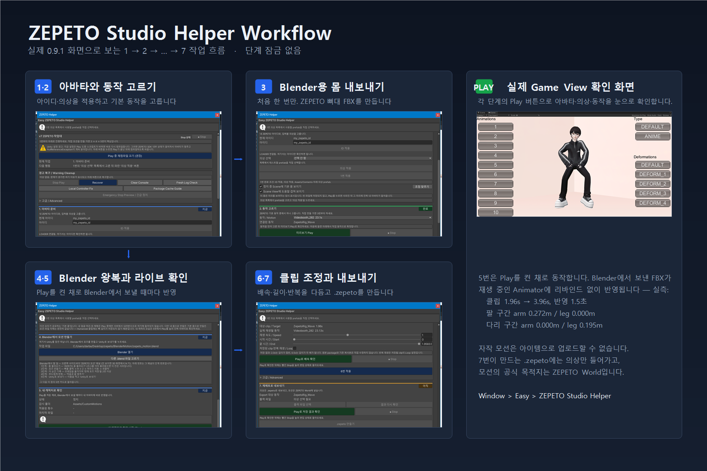
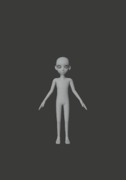
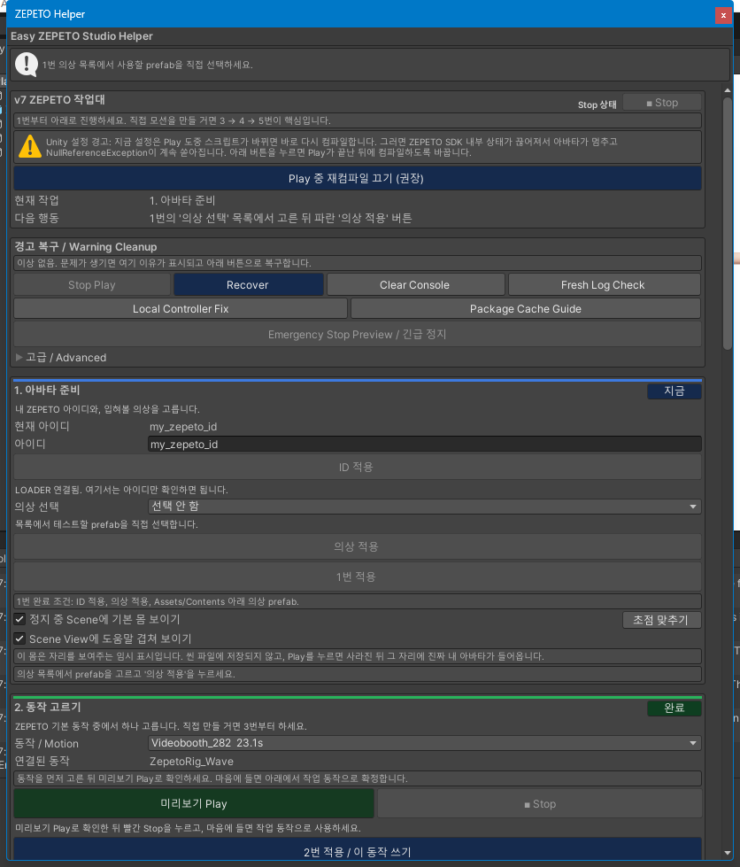
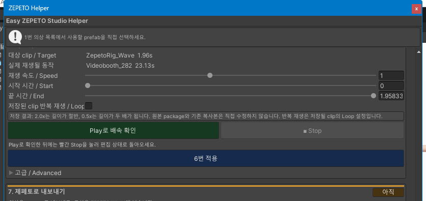
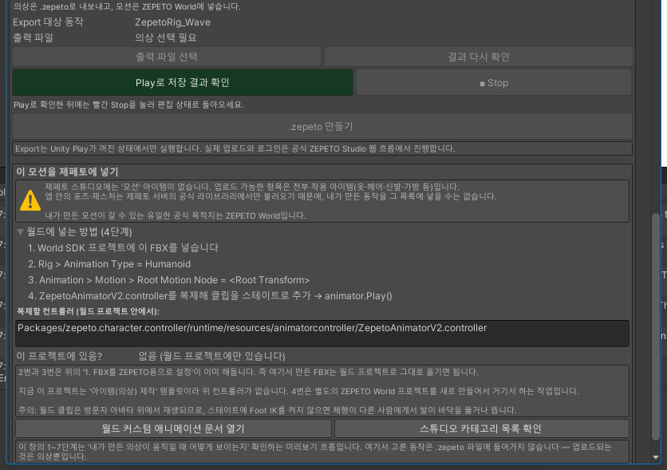

<div align="center">

# ZEPETO Studio Helper

처음 쓰는 사람도 Unity 안에서 `1 -> 2 -> ... -> 7` 순서대로 누르면
의상 확인, 동작 선택, Blender로 직접 모션 만들기, 내 캐릭터로 라이브 확인, `.zepeto` 생성까지
끝낼 수 있게 만든 ZEPETO Studio 작업대

[](https://unity.com/)
[](https://studio.zepeto.me/)
[](package.json)
[](#처음-사용하는-순서)
[](Documentation~/QA_AUDIT.md)



### 이 도구로 만든 10초짜리 춤



Blender에서 뼈를 돌려 찍은 **20비트(120 BPM) · 240프레임 · 10.0초** 루프입니다.
`BlenderMotion/make_dance.py`가 이 안무를 그대로 다시 만들어 냅니다 — 손으로 만든 뒤 캡처한 것이
아니라, 스크립트가 애드온의 **버튼과 게이트를 그대로 통과해서** 내보낸 결과입니다.

| 무엇 | 실측값 |
| --- | --- |
| 길이 | 240프레임 @ 24fps = **10.0초**, Unity 임포트 후 클립 **9.96초** |
| 루프 | 첫 프레임과 끝 프레임의 각도차 **0.00e+00 rad** (완전히 이어짐) |
| 손 이동 거리 (Blender, 한 바퀴) | 왼손 **7.82m** / 오른손 **7.77m** |
| 머리 · 발 | 머리 **2.25m**, 양발 각 **1.20m** |
| Unity Play 중 실제 아바타 | 오른손이 골반 기준 **0.654m** 이동 (`custom-motion:avatar-animating`) |

> 특정 곡의 실제 안무는 저작물이라 옮기지 않았습니다. 위 동작은 **창작**이고, 120 BPM에 맞춰
> 한 비트가 정확히 12프레임이라 그 템포의 어떤 곡에도 박자가 맞습니다.

### 실제 Play 확인 화면

Helper의 `Play` 버튼을 누르면 Unity `Game View`에서 아바타, 의상, 동작 상태를 바로 확인합니다.


<details>
<summary>전체 Helper 창 보기</summary>



</details>

</div>

## 캡처 이미지에 대하여

0.9.1에서 캡처를 **실제 Unity 2020.3.9f1에서 전부 다시 만들었습니다.** 씬 `LOADER`의 `zepetoId`를
`my_zepeto_id` placeholder로 바꿔놓고 촬영한 뒤 원래 값으로 되돌렸으므로, 화면 캡처에는 개인 아이디가
없고 전부 현재 7단계 UI입니다.

| 파일 | 내용 |
| --- | --- |
| `docs/images/workflow-overview.png` | 7단계 전체 흐름 도해 — 실제 캡처 4장 + Play 화면으로 새로 구성 |
| `docs/images/helper-window.png` | 창 전체 (안전 패널 + 1·2번 카드) |
| `docs/images/step-1-avatar-outfit.png` | 1번 카드 |
| `docs/images/step-2-motion-select.png` | 2번 카드 + 3번 카드 |
| `docs/images/step-4-5-blender-live.png` | 4번 Blender 왕복 + 5번 라이브 확인 (이전에는 캡처가 없던 구간) |
| `docs/images/step-3-clip-adjust.png` | 실제 **6번** 클립 조정 화면 (파일명은 옛 4단계 시절 이름) |
| `docs/images/step-4-save-export.png` | 실제 **7번** 제페토로 내보내기 화면 (파일명 동일 사유) |
| `docs/images/play-preview.png` | Play 중 Game View. **제작자 본인 아바타가 나옵니다** — 공개해도 된다는 판단 하에 유지합니다 |
| `docs/images/dance-demo.gif` | 이 도구로 만든 10초 안무. Blender Workbench 렌더 120프레임(2프레임 간격), 12fps 재생 = 원래 속도. `BlenderMotion/make_dance.py`로 언제든 다시 만들 수 있습니다 |

`npm pack`은 `docs/`를 포함하므로 이 이미지들은 tarball과 GitHub 렌더링 양쪽에 나갑니다.
`play-preview.png`에 아바타가 보이는 것은 **의도된 상태**입니다. 다른 계정으로 배포하거나 아바타를
드러내고 싶지 않다면 그 파일만 교체하거나 삭제하세요.

> 자체 테스트의 `no-personal-id-in-source` 검사는 `.cs`와 `.md`만 읽으므로 **구조적으로 PNG를 볼 수
> 없습니다.** 그 검사가 초록이어도 이미지는 검증된 것이 아닙니다. 위 표가 그 공백을 메우는 기록입니다.

### 참고 — 교체 전 캡처에 있던 화면

교체 전 캡처는 저장소 이력상 **2026-05-24 커밋의 0.2.x(4단계 마법사) 화면**이었습니다
(`git log --diff-filter=A -- docs/images`). 지금은 존재하지 않는 것들이라, 옛 문서나 스크린샷을
어딘가에서 보게 되면 아래를 기억하세요.

- 헤더의 `1. 아바타 / 2. 동작 / 3. 클립 / 4. Export` 4칸 레일
- `1-1. 아이디 입력` / `1-2. 의상 선택` / `1-3. Play 확인` 하위 번호
- `1번 적용 / 다음 단계`, `수정 잠금 해제`, `이전 단계를 완료하면 열립니다` — 단계 잠금은 없어졌습니다

| 옛 화면의 제목 | 현재 카드 |
| --- | --- |
| `1. 아바타와 의상 준비` | **1**번 아바타 준비 |
| `2. 동작 선택` | **2**번 동작 고르기 |
| `3. 클립 조정` | **6**번 클립 조정 |
| `4. 저장과 내보내기` | **7**번 제페토로 내보내기 |

## 한 줄 요약

공식 ZEPETO Studio SDK 프로젝트에 이 패키지를 추가한 뒤, Unity 메뉴에서 아래 창을 열고 파란 적용 버튼만 순서대로 누르면 됩니다.

```text
Window > Easy > ZEPETO Studio Helper
```

## 처음 보는 사람용 체크리스트

| 확인 | 어디서 보나요 | 되어 있으면 |
| --- | --- | --- |
| ZEPETO SDK가 설치됨 | `Packages/manifest.json` 또는 Package Manager | `zepeto.studio`가 보임 |
| helper가 설치됨 | Package Manager | `com.easy.zepeto-helper`가 보임 |
| 작업 scene이 열림 | Unity Hierarchy | `LOADER`가 보임 |
| 의상 prefab이 있음 | Project 창 | `Assets/Contents/.../*.prefab`이 보임 |
| helper 창이 열림 | Unity 상단 메뉴 | `Window > Easy > ZEPETO Studio Helper` |

`helper 창이 열림`까지 확인되면 바로 아래 순서대로 진행하면 됩니다. `helper가 설치됨`이 보이지 않으면 먼저 설치 방법으로 내려가세요.

## 내 상황별 빠른 길

| 지금 상태 | 바로 할 일 |
| --- | --- |
| ZEPETO SDK 프로젝트가 이미 있음 | `설치 방법`을 보고 helper 추가 (Git URL 주의 사항을 먼저 읽으세요) |
| helper 설치는 끝났는데 창을 못 찾겠음 | `Window > Easy > ZEPETO Studio Helper` 열기 |
| 창은 열렸는데 1번에서 막힘 | `LOADER`가 있는 scene인지 확인 |
| 의상 선택 목록이 비어 있음 | 의상 prefab을 `Assets/Contents` 아래로 옮기기 |
| export 후 파일 위치를 모르겠음 | 7번 단계의 `출력 파일` 줄 확인 |

## 처음 사용하는 순서

창을 열면 번호가 붙은 7개 단계가 위에서 아래로 놓여 있습니다. **어떤 단계도 잠기지 않습니다.**
아직 못 하는 게 있으면 그 자리에 이유가 적힙니다.

| 번호 | 하는 일 | 언제 필요한가 |
| --- | --- | --- |
| **1** | 아바타 준비 — 아이디 입력 · 의상 선택 | 항상 |
| **2** | 동작 고르기 — ZEPETO 기본 동작 목록 | 기본 동작을 쓸 때 |
| **3** | Blender용 몸 내보내기 | 직접 만들 때, **처음 한 번만** |
| **4** | Blender에서 모션 만들기 | 직접 만들 때, 매번 |
| **5** | 내 캐릭터로 확인 (라이브) | 직접 만들 때, 매번 |
| **6** | 클립 조정 — 배속 · 길이 · 반복 | 손볼 게 있을 때 |
| **7** | 제페토로 내보내기 — `.zepeto` + 월드 안내 | 마지막 |

### 기본 동작만 쓸 때

1번 → 2번 → (필요하면 6번) → 7번.

### 직접 모션을 만들 때

1번 → **3번 → 4번 → 5번** → (필요하면 6번) → 7번.

3·4·5번이 Blender 왕복입니다. 3번은 평생 한 번이고, 그 다음부터는 4번과 5번만 반복합니다.
5번의 초록 버튼을 누르면 Play가 켜진 채로 유지되며, Blender에서 `Unity로 보내기`를 누르고
Unity 창을 다시 클릭할 때마다 내 아바타에 바로 반영됩니다.

> **모션은 `.zepeto` 아이템으로 못 올립니다.** 제페토 스튜디오에 모션 카테고리가 없습니다.
> 직접 만든 모션이 갈 수 있는 곳은 ZEPETO World뿐이고, 7번 패널이 그 방법을 안내합니다.

## 아이디 입력

1번의 `아이디` 칸에 직접 입력하고 `ID 적용`을 누릅니다.

- 아이디는 **씬의 `LOADER`에만** 저장됩니다. 창을 다시 열면 거기 있는 값을 그대로 읽어옵니다.
- 앞의 `@`와 공백은 자동으로 지워집니다. `@my_zepeto_id`를 붙여넣어도 `my_zepeto_id`로 들어갑니다.
- 쓸 수 있는 문자는 영문, 숫자, `_`, `.`, `-` 입니다.
- 아이디를 바꾸면 아바타가 달라지므로 1번을 다시 확인하게 됩니다.

## 내가 만든 모션 쓰기

ZEPETO는 **Humanoid 애니메이션만** 재생합니다.

**Blender로 만들 때**는 3 → 4 → 5번을 쓰세요. 아래 표는 필요 없습니다 — 5번이 임포트 설정까지 자동으로 합니다.

**Mixamo에서 받은 FBX처럼** Blender를 거치지 않은 파일은 5번 안의 `직접 등록하기 (Mixamo 등)`를 펼쳐서 넣습니다.

| 순서 | 할 일 |
| --- | --- |
| 1 | FBX를 `Assets` 아래에 넣습니다 |
| 2 | Project 창에서 그 FBX를 클릭합니다 |
| 3 | `1. FBX를 ZEPETO용으로 설정` (Animation Type을 Humanoid로 바꿉니다) |
| 4 | `2. 내 모션으로 추가` (`Assets/ZepetoHelper/Motions`에 `.anim`으로 저장) |
| 5 | 2번 목록에서 `[내 모션]` 항목을 고르고 `2번 적용 / 이 동작 쓰기` |

동작 목록에 붙는 표시:

| 표시 | 뜻 |
| --- | --- |
| `[내 모션]` | 내가 추가한 클립 |
| `(포즈)` | 0.1초 이하 정지 포즈. 그대로 쓰면 아바타가 움직이지 않습니다 |
| `(Humanoid 아님)` | 재생 불가. `1. FBX를 ZEPETO용으로 설정`을 먼저 하세요 |

## 실제 화면으로 따라하기

### 1. 아바타 준비

아이디를 넣고 `ID 적용`, `Assets/Contents` 아래 의상 prefab을 골라 `의상 적용`을 누릅니다.
`정지 중 Scene에 기본 몸 보이기`를 켜두면 Play 전에도 자리와 크기를 눈으로 볼 수 있습니다.


### 2. 동작 고르기

ZEPETO 기본 동작을 고르고 `미리보기 Play`로 확인한 뒤 `2번 적용 / 이 동작 쓰기`를 누릅니다.
직접 만들 거면 이 단계를 건너뛰고 3번으로 갑니다.


### 3. Blender용 몸 내보내기 (처음 한 번만)

`ZEPETO 리그 내보내기`를 누르면 `Assets/ZepetoHelper/Rig/ZepetoBaseModel.fbx`가 만들어집니다.
Blender에서 ZEPETO의 실제 뼈 이름·뼈대로 작업하기 위한 파일입니다.

### 4. Blender에서 모션 만들기

`Blender 열기`를 누릅니다. Blender 오른쪽 사이드바(`N` 키)의 `ZEPETO 모션` 패널에서
뼈를 클릭 → `R` → 축 → 좌클릭으로 포즈를 잡고, `현재 포즈 저장`을 2번 이상,
`처음과 끝 맞추기`, `Unity로 보내기` 순서로 누릅니다.

자세한 내용은 `BlenderMotion/README_모션만들기.md`에 있습니다.

### 5. 내 캐릭터로 확인

초록 `내 캐릭터로 확인 시작 (Play)`을 누르면 Play가 켜지고 내 실제 아바타가 서버에서 내려옵니다.
**Play는 끄지 마세요.** Blender에서 `Unity로 보내기`를 누른 뒤 Unity 창을 다시 클릭하면
1~2초 안에 동작이 바뀌고 `적용된 횟수`가 올라갑니다.

4번과 5번 카드는 이렇게 보입니다. 4번의 번호(`1단계`~`5단계`)는 **Blender 패널의 단계 번호**이고
이 창의 카드 번호와 다릅니다.


### 6. 클립 조정

배속, 시작 시간, 끝 시간, 반복 여부를 조정하고 `Play로 배속 확인` 후 `6번 적용 / 저장`을 누릅니다.



### 7. 제페토로 내보내기

`Play로 저장 결과 확인` 후 `.zepeto 만들기`를 누르고 `출력 파일` 줄의 경로를 확인합니다.
그 아래 `이 모션을 제페토에 넣기` 패널이 모션을 ZEPETO World에 넣는 방법을 안내합니다.



### Play 화면

각 단계의 Play 버튼을 누르면 실제 Game View에서 아바타와 의상, 동작 상태를 확인합니다.


## 설치 방법

> **먼저 읽어주세요. Git URL로 설치하면 이 README의 기능이 들어오지 않습니다.**
>
> 공개 저장소의 `origin/main`에 올라가 있는 것은 **0.2.4**입니다. 4단계 마법사 버전이고
> **Blender 왕복(3·4·5번)이 없습니다.** 이 문서가 설명하는 0.10.0은 아직 push하지 않은 로컬 커밋에만
> 있습니다. 그래서 아래 `Add package from git URL`과 `manifest.json`의 git 주소는 0.10.0이 아니라
> 0.2.4를 설치합니다.
>
> 7단계 흐름과 Blender 왕복을 쓰려면 이 패키지 폴더를 프로젝트의 `Packages/` 아래에 그대로 두세요
> (임베디드 설치).
>
> ```text
> <Unity 프로젝트 폴더>/Packages/com.easy.zepeto-helper/
> ```
>
> **이때 `manifest.json`에는 아무것도 적지 않습니다.** Unity가 `Packages/` 아래 폴더를 자동으로
> 인식합니다. 이 프로젝트의 `Packages/manifest.json`에도 `com.easy.zepeto-helper` 항목이 없습니다.
>
> 자세한 방법은 [docs/ENVIRONMENT.md](docs/ENVIRONMENT.md)의 `helper 패키지 추가`에 있습니다.
> 아래 git 주소 방법은 저장소가 갱신된 뒤에 쓸 수 있습니다.

### 가장 쉬운 설치 (다만 지금은 0.2.4가 설치됩니다)

Unity에서 아래 순서대로 클릭합니다.

1. `Window > Package Manager`
2. 왼쪽 위 `+`
3. `Add package from git URL...`
4. 아래 주소 붙여넣기

```text
https://github.com/RURUGURU/zepeto_studio_helper.git
```

이 주소로 받은 것은 위에서 설명한 대로 **0.2.4**입니다. 창에 1~4번만 보이고 `Blender 열기`,
`내 캐릭터로 확인 시작 (Play)` 버튼이 없으면 이 버전을 받은 것입니다.

설치가 끝나면 아래 메뉴가 생깁니다.

```text
Window > Easy > ZEPETO Studio Helper
```

### manifest.json으로 설치

Unity 프로젝트의 `Packages/manifest.json`에 필요한 줄만 추가합니다.

```json
{
  "dependencies": {
    "com.easy.zepeto-helper": "https://github.com/RURUGURU/zepeto_studio_helper.git",
    "zepeto.studio": "3.2.16"
  },
  "scopedRegistries": [
    {
      "name": "ZEPETO",
      "url": "https://upm.zepeto.run",
      "scopes": [
        "zepeto"
      ]
    }
  ]
}
```

이미 `dependencies`나 `scopedRegistries`가 있다면 전체 파일을 덮어쓰지 말고 위 항목만 합쳐 넣습니다.

`zepeto.studio` 줄에 대해:

- 위 값 `3.2.16`은 **검증한 프로젝트에 실제로 들어 있는 버전**입니다. 그대로 붙여넣어도 안전합니다.
- helper가 요구하는 **최소** 버전은 `3.2.12`입니다. 그보다 낮으면 helper가 안내를 표시합니다.
- 이미 `zepeto.studio`가 있고 버전이 `3.2.16` 이상이면 **그 줄은 건드리지 마세요.** 낮은 값으로 바꾸면
  SDK가 다운그레이드됩니다.

### tarball로 설치

GitHub가 아니라 파일로 설치하고 싶을 때 사용합니다.

`npm pack`은 **지금 checkout되어 있는 내용을 그대로** 압축합니다. 저장소를 clone해서 압축하면
위에서 말한 0.2.4가 나오므로, 0.10.0 tarball은 0.10.0이 들어 있는 로컬 패키지 폴더에서 만들어야 합니다.

```powershell
cd <Unity 프로젝트 폴더>\Packages\com.easy.zepeto-helper
npm pack
```

생성되는 파일 (이름의 버전은 `package.json`의 `version`을 따릅니다):

```text
com.easy.zepeto-helper-0.10.0.tgz
```

Unity에서는 `Window > Package Manager > + > Add package from tarball...`을 누르고 `.tgz` 파일을 선택합니다.

tarball에 들어가는 것은 `.npmignore`가 정합니다. README가 링크하는 `docs/`(환경 문서 + 캡처 이미지)는
포함되고, 내부 QA 기록인 `Documentation~/`는 **빠집니다**. QA 기록은 저장소에서만 볼 수 있습니다.

`docs/`가 들어간다는 것은 캡처 이미지도 tarball에 실린다는 뜻입니다. 무엇이 들어 있는지는 위
`캡처 이미지에 대하여` 표가 파일 단위로 적어둔 그대로이고, 그중 배포를 다시 판단해야 하는 것은
`play-preview.png` 한 장뿐입니다.

## 버튼 이름이 헷갈릴 때

| 버튼 | 뜻 |
| --- | --- |
| `Play` | Unity 화면에서 실제 아바타와 동작을 확인 |
| `Stop` | 확인을 끝내고 편집 가능한 상태로 돌아옴 |
| `적용` | 지금 선택한 값을 helper가 작업 상태로 저장 (완료 후에도 다시 누를 수 있습니다) |
| `Blender 열기` | 4번에서 작업용 `.blend` 파일을 엽니다 |
| `내 캐릭터로 확인 시작 (Play)` | 5번. Play를 켠 채로 Blender와 연결합니다 |
| `.zepeto 만들기` | 공식 ZEPETO export를 실행하고 결과 파일 경로 표시 |

## 저장되는 파일

| 파일 | 저장 위치 | 언제 생기나요 |
| --- | --- | --- |
| Blender용 리그 | `Assets/ZepetoHelper/Rig/ZepetoBaseModel.fbx` | 3번 내보내기 후 |
| Blender에서 온 모션 FBX | `Assets/CustomMotions` | Blender의 `Unity로 보내기` |
| 내 모션 clip | `Assets/ZepetoHelper/Motions/<FBX 이름>.anim` | `2. 내 모션으로 추가` 후 |
| 라이브 확인용 clip | `Assets/ZepetoHelper/Motions/LiveFromBlender.anim` | 5번 시작 시 |
| 작업용 동작 복사본 | `Assets/ZepetoHelper/Animations` | 2번 적용 후 |
| **재생용 컨트롤러 사본** | `Assets/ZepetoHelper/Controllers/PlaygroundAnimatorController_local.overrideController` | 동작을 처음 적용할 때 |
| 조정된 clip | `Assets/ZepetoHelper/Animations/ClipEdits` | 6번 적용 후 |
| 임시 미리보기 clip | `Assets/ZepetoHelper/Animations/Preview/clip_adjust_preview.anim` | Play 확인 중 |
| 최종 `.zepeto` | 의상 prefab이 있는 폴더 | 7번 생성 후 |

재생용 컨트롤러 사본은 helper가 알아서 만들고 알아서 다시 씁니다. 아바타가 무엇을 재생할지는 이 파일의
override 슬롯이 정하고 `AnimationClip` 필드가 정하지 않으므로, 동작을 바꿀 때마다 이 파일이 바뀝니다.
지우면 다음 적용에서 다시 만들어집니다. 계측 근거는 `Documentation~/QA_AUDIT.md`의 `실제 재생 경로`에
있습니다. SDK가 패키지에 넣어 배포하는 원본 컨트롤러는 건드리지 않습니다.

최종 파일명 예시:

```text
ZEPETO_TRANSPARENT_1_VideoBooth_139_v02.zepeto
```

검증된 실제 출력 예시:

```text
Assets/Contents/TRANSPARENT_1/ZEPETO_TRANSPARENT_1_VideoBooth_139_v02.zepeto
```

## 막혔을 때 먼저 볼 곳

| 증상 | 먼저 확인할 것 |
| --- | --- |
| helper 메뉴가 안 보임 | Package Manager에 `com.easy.zepeto-helper`가 설치됐는지 확인 |
| `LOADER` 연결 안내가 나옴 | `작업 준비 / Setup`의 `작업 scene` 목록에서 씬을 고르고 `씬 열기` |
| 씬 목록이 비어 있음 | `LOADER`가 들어 있는 scene이 프로젝트에 없음. ZEPETO Studio 템플릿 씬을 `Assets` 아래에 넣기 |
| 의상 목록이 비어 있음 | prefab이 `Assets/Contents` 아래에 있는지 확인 |
| `ID 적용` 버튼이 눌리지 않음 | 아이디가 비었거나, 이미 적용된 아이디거나, 쓸 수 없는 문자가 들어 있음 |
| 아이디를 바꿨더니 1번이 다시 열림 | 정상. 아바타가 바뀌었으니 1번만 다시 확인하면 됨 |
| 5번 `적용된 횟수`가 안 올라감 | Blender에서 보낸 뒤 **Unity 창을 다시 클릭**했는지 확인. 그 아래 메시지에 이유가 뜹니다 |
| Blender에서 돌린 관절이 Unity에서 안 움직임 | Humanoid에 매핑되지 않은 뼈입니다. Blender 패널이 그런 뼈 49개를 기본으로 숨깁니다 |
| Play가 비활성화됨 | 빨간 Stop 상태라면 Stop을 먼저 누름 |
| **아바타가 안 움직임 / NullReferenceException 반복** | **헬퍼 상단 Play 중 재컴파일 끄기 (권장)를 누르고, Stop 후 다시 Play. Play 도중 스크립트가 재컴파일되면 SDK가 깨집니다** |
| `.zepeto`가 안 보임 | 7번의 `결과 다시 확인`을 누르고 Unity Console 확인 |

## 검증한 환경

| 항목 | 값 |
| --- | --- |
| 운영체제 | Windows 11 |
| Unity | `2020.3.9f1` |
| ZEPETO Studio | `3.2.12` 이상 (`3.2.16`에서 확인) |
| 패키지 이름 | `com.easy.zepeto-helper` |
| 패키지 버전 | `0.10.0` |
| ZEPETO registry | `https://upm.zepeto.run` |

환경 설정 상세는 [docs/ENVIRONMENT.md](docs/ENVIRONMENT.md), 검증 기록은 [Documentation~/QA_AUDIT.md](Documentation~/QA_AUDIT.md)에 정리되어 있습니다.
`Documentation~/`는 배포 tarball에 넣지 않으므로, QA 기록은 저장소에서 보세요.

## 개발자 명령어

패키지 폴더로 이동:

```powershell
cd <Unity 프로젝트 폴더>\Packages\com.easy.zepeto-helper
```

패키지 내용 확인:

```powershell
npm pack --dry-run --json
```

실제 `.tgz` 생성:

```powershell
npm pack
```

산출물 폴더로 이동:

```powershell
New-Item -ItemType Directory -Force -Path ..\..\Build\Packages
Move-Item -Force .\com.easy.zepeto-helper-0.10.0.tgz ..\..\Build\Packages\com.easy.zepeto-helper-0.10.0.tgz
```

압축 파일 내용 확인:

```powershell
tar -tzf ..\..\Build\Packages\com.easy.zepeto-helper-0.10.0.tgz
```
